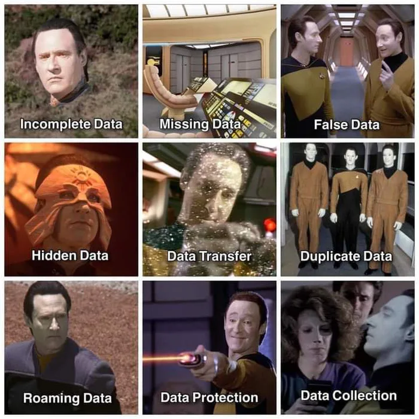
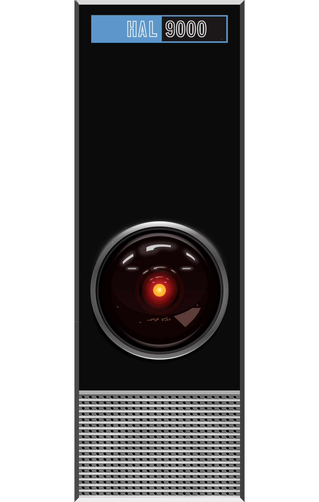
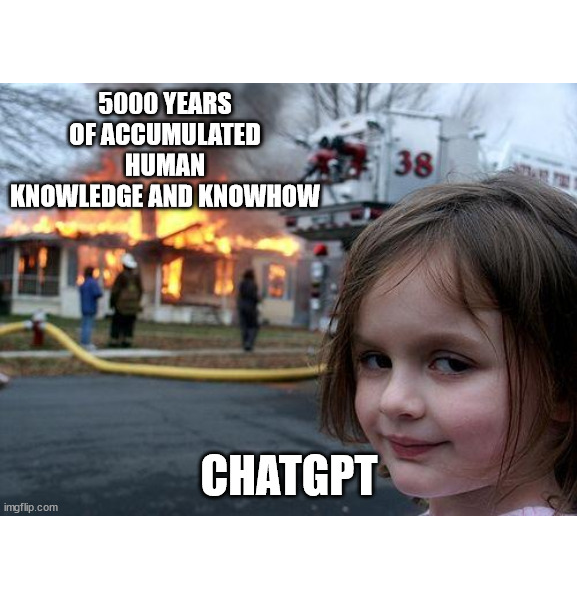
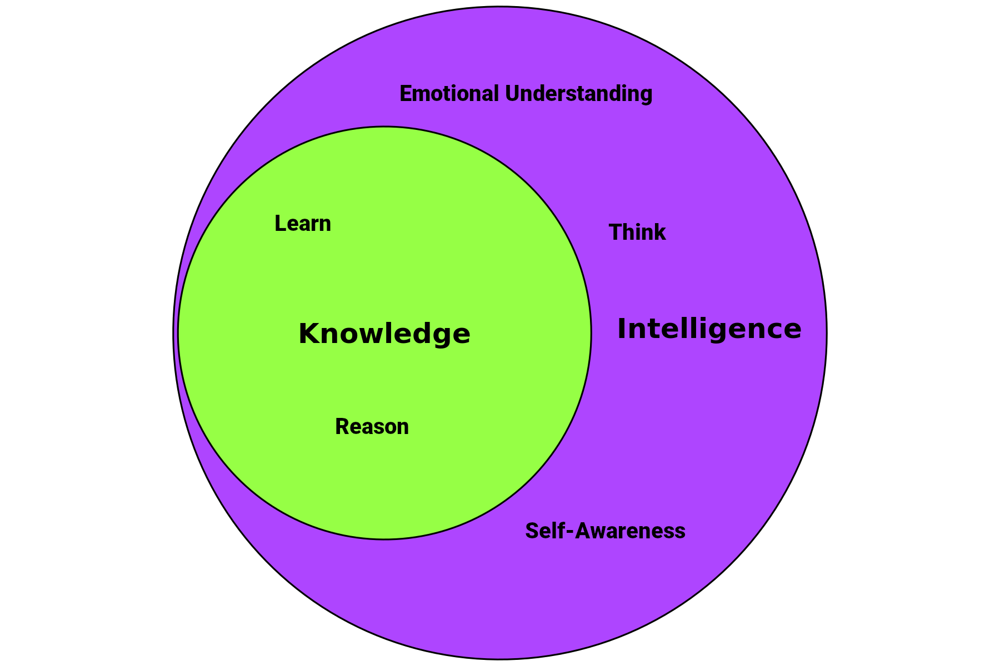
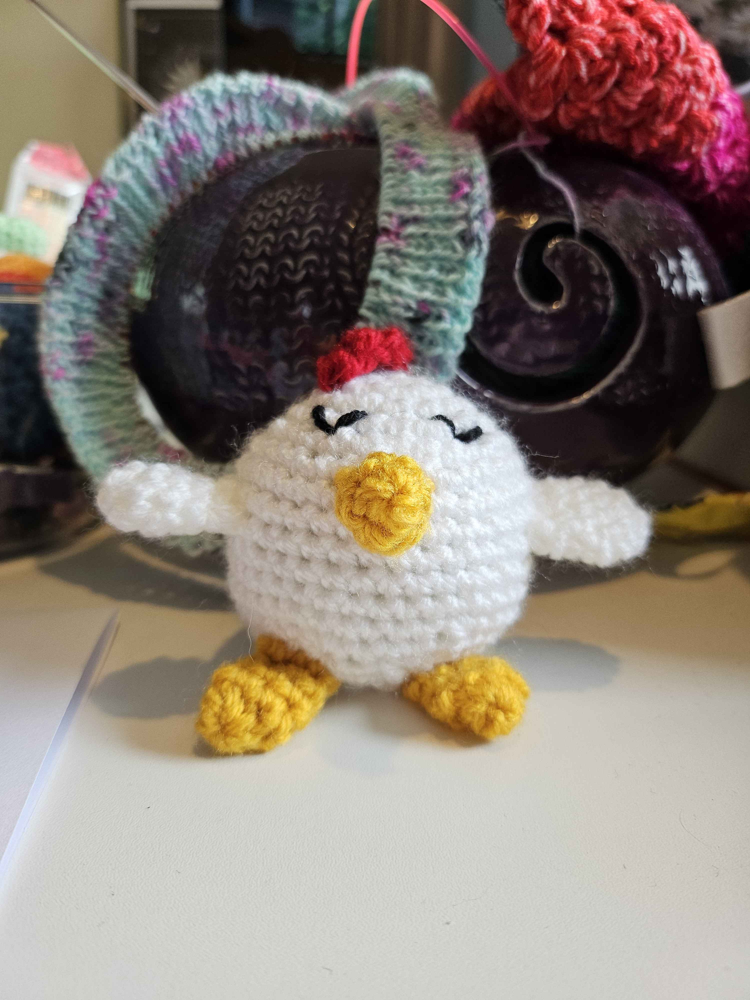
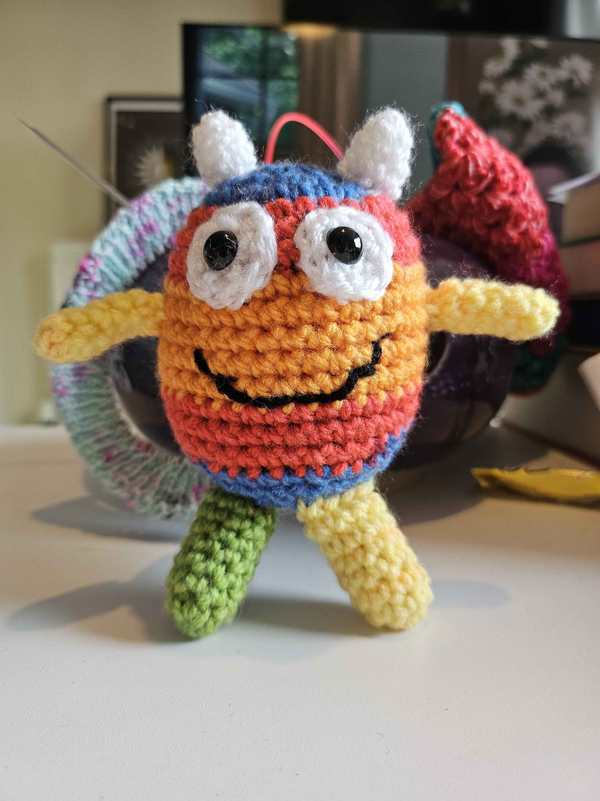
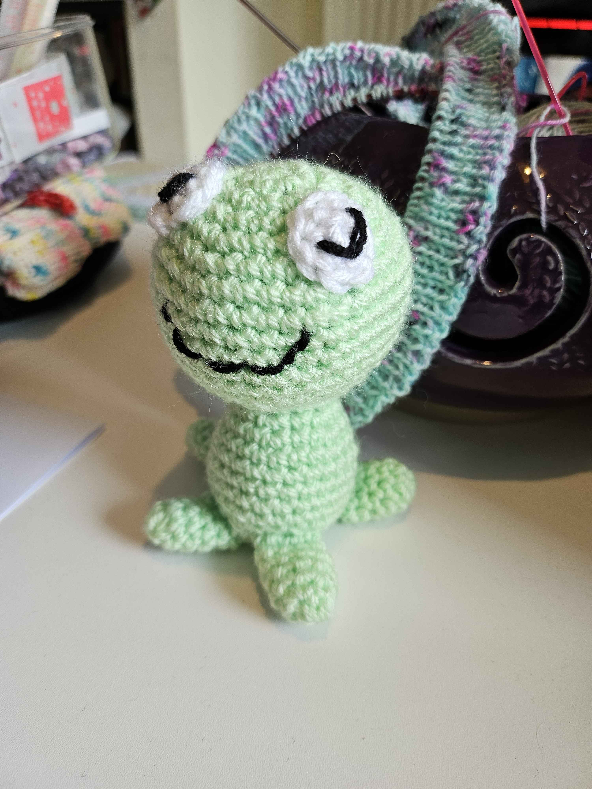
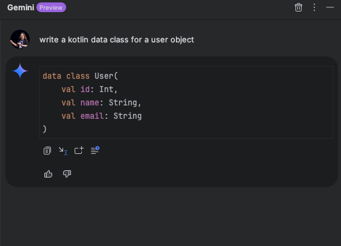
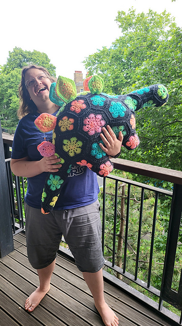

# AI is dead, long live AK
## Exploring Artificial Intelligence vs. Artificial Knowledge

---

# Artificial Intelligence in fiction



---

## Artificial Intelligence in fiction
# The Good


---

## Artificial Intelligence in fiction
# The Bad



---

## Artificial Intelligence in fiction

* Think
* Learn
* Reasoning
* Emotional Understanding
* Self-Awareness

---

# Artificial Intelligence in reality



---

## Artificial Intelligence in reality

# Narrow AI

Focused on one narrow task.

---

## Artificial Intelligence in reality

# Narrow AI
- Think
- Learn
- Reasoning
- Emotional Understanding
- Self-Awareness

---

## Artificial Intelligence in reality

# Narrow AI
- Think
- Learn
- Reasoning
- Emotional Understanding
- <span style="color:red;">✗</span> ~~Self-Awareness~~ 

---

## Artificial Intelligence in reality

# Narrow AI
- Think
- Learn
- Reasoning
- <span style="color:red;">✗</span> ~~Emotional Understanding~~
- <span style="color:red;">✗</span> ~~Self-Awareness~~

---

## Artificial Intelligence in reality

# Narrow AI
- Think
- Learn
- <span style="color:green;">✓</span> Reasoning 
- <span style="color:red;">✗</span> ~~Emotional Understanding~~
- <span style="color:red;">✗</span> ~~Self-Awareness~~

---

## Artificial Intelligence in reality

# Narrow AI
- Think
- <span style="color:green;">✓</span> Learn
- <span style="color:green;">✓</span> Reasoning 
- <span style="color:red;">✗</span> ~~Emotional Understanding~~
- <span style="color:red;">✗</span> ~~Self-Awareness~~

---

## Artificial Intelligence in reality

# Narrow AI
- <span style="color:orange;">?</span> Think
- <span style="color:green;">✓</span> Learn
- <span style="color:green;">✓</span> Reasoning 
- <span style="color:red;">✗</span> ~~Emotional Understanding~~
- <span style="color:red;">✗</span> ~~Self-Awareness~~

---

# Intelliegence vs Knowledge


---

# (Current) AI limitations

---

## (Current) AI limitations

# Generative Content that required "Thought".

---

## (Current) AI limitations

# Write a crochet pattern of an amigurumi chicken


---



---

## (Current) AI limitations

# Write a crochet pattern of an amigurumi monster


---



---

## (Current) AI limitations

# Write a crochet pattern of an amigurumi frog


---



---

## (Current) AI limitations

# Confidently Wrong

---

## (Current) AI limitations

# Contextual Thought

---

<video src="videos/ai-gym.mp4" controls width="80%"></video>


Source - https://x.com/i/status/1808188513512575179


---

# Artificial Knowledge Success

---

## Artificial Knowledge Success
# Boiler plate code



---

## Artificial Knowledge Success
# Voice Transcription and sentiment analysis

---
``` json
"transcript": [
        {
          "sentence": "Transcription example.",
          "timestamp": 9630,
          "duration": 2642,
          "action_items": [],
          "questions": [],
          "answers": [],
          "raw_sentence": "transcription example",
          "words": [
            {
              "word": "transcription",
              "start_time": 9630,
              "end_time": 10887,
              "confidence": 1
            },
            {
              "word": "example",
              "start_time": 10952,
              "end_time": 11726,
              "confidence": 0.990055
            }
          ],
          "sentiments": [
            {
              "text_part": "transcription example",
              "score": 0.1213
            }
          ]
        }
      ],
```
---

## Artificial Knowledge Success
# Voice Transcription and sentiment analysis

https://developer.vonage.com/en/voice/voice-api/concepts/recording#transcription-beta


---

## Artificial Knowledge Success
# Medical diagnostics

Detecting novel systemic biomarkers in external eye photos

https://research.google/blog/detecting-novel-systemic-biomarkers-in-external-eye-photos/


---

# The issue with "AI"

Ethical implications of misrepresenting AI as intelligent

---

##  The issue with "AI"
# Trust

---

##  The issue with "AI"
# Accountability

---

# AI is dead, long live AK
But are we too late?

---

# Disclaimer

My wife is a very good crocheter and the AI generated partners are not a good example of her skills...so have this dino.



---

# Thank you!

 


links.zpweb.site

github.com/devwithzachary/presentations


