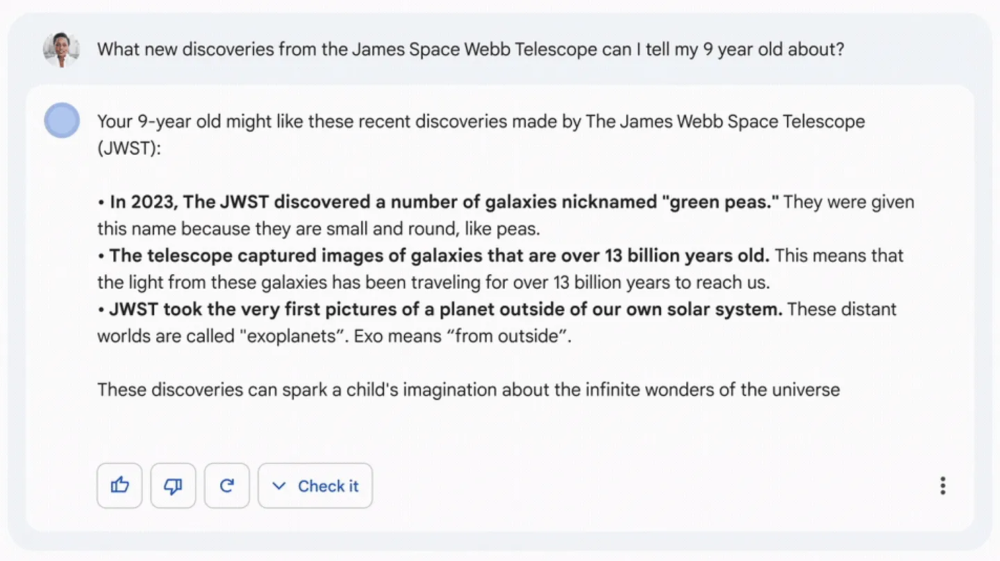

# AI is Dead, Long Live AK
## Exploring Intelligence vs. Knowledge

---

# WARNING: This Talk Includes QR Codes


---

# Artificial Intelligence in Fiction


---

## Artificial Intelligence in Fiction
# The Good


---

## Artificial Intelligence in Fiction
# The Bad


---

## Artificial Intelligence in Fiction

* Think
* Learn
* Reasoning
* Emotional Understanding
* Self-Awareness

---

# Artificial Intelligence in Reality


---

## Artificial Intelligence in Reality

# Narrow AI

Focused on one narrow task.

---

## Artificial Intelligence in Reality

# Narrow AI
- Think
- Learn
- Reasoning
- Emotional Understanding
- Self-Awareness

---

## Artificial Intelligence in Reality

# Narrow AI
- <span style="color:orange;">?</span> Think
- Learn
- Reasoning
- Emotional Understanding
- Self-Awareness

---

## Artificial Intelligence in Reality

# Narrow AI
- <span style="color:orange;">?</span> Think
- <span style="color:green;">✓</span> Learn
- Reasoning
- Emotional Understanding
- Self-Awareness

---

## Artificial Intelligence in Reality

# Narrow AI
- <span style="color:orange;">?</span> Think
- <span style="color:green;">✓</span> Learn
- <span style="color:green;">✓</span> Reasoning 
- Emotional Understanding
- Self-Awareness

---

## Artificial Intelligence in Reality

# Narrow AI
- <span style="color:orange;">?</span> Think
- <span style="color:green;">✓</span> Learn
- <span style="color:green;">✓</span> Reasoning 
- <span style="color:red;">✗</span> ~~Emotional Understanding~~
- Self-Awareness

---

## Artificial Intelligence in Reality

# Narrow AI
- <span style="color:orange;">?</span> Think
- <span style="color:green;">✓</span> Learn
- <span style="color:green;">✓</span> Reasoning 
- <span style="color:red;">✗</span> ~~Emotional Understanding~~
- <span style="color:red;">✗</span> ~~Self-Awareness~~

---

# Intelliegence vs Knowledge


---

# (Current) AI Limitations

---

## (Current) AI Limitations

# Generative Content That Required Creative "Thought".

---

## (Current) AI Limitations

# Write a crochet pattern of an amigurumi chicken


---


---

## (Current) AI Limitations

# Write a crochet pattern of an amigurumi monster


---


---

## (Current) AI Limitations

# Write a crochet pattern of an amigurumi frog


---


---

## (Current) AI Limitations

# Contextual Thought

---

<video src="videos/ai-gym.mp4" controls width="80%"></video>


Source - https://x.com/i/status/1808188513512575179

---

## (Current) AI Limitations

# Confidently Wrong 



---

## (Current) AI Limitations

# Easily Manipulated 


---

# Artificial Knowledge Success

---

## Artificial Knowledge Success
# Boiler Plate Code


---

## Artificial Knowledge Success
# Voice Transcription and Sentiment Analysis

---

## Artificial Knowledge Success
# Voice Transcription and Sentiment Analysis

https://developer.vonage.com/en/voice/voice-api/concepts/recording


---

``` json
"transcript": [
        {
          "sentence": "Transcription example.",
          "timestamp": 9630,
          "duration": 2642,
          "action_items": [],
          "questions": [],
          "answers": [],
          "raw_sentence": "transcription example",
          "words": [
            {
              "word": "transcription",
              "start_time": 9630,
              "end_time": 10887,
              "confidence": 1
            },
            {
              "word": "example",
              "start_time": 10952,
              "end_time": 11726,
              "confidence": 0.990055
            }
          ],
          "sentiments": [
            {
              "text_part": "transcription example",
              "score": 0.1213
            }
          ]
        }
      ],
```
---

## Artificial Knowledge Success
# Medical Diagnostics

Detecting novel systemic biomarkers in external eye photos

https://research.google/blog/detecting-novel-systemic-biomarkers-in-external-eye-photos/


---

# The Issue with "AI"

Ethical implications of misrepresenting AI as intelligent

---

##  The Issue with "AI"
# Trust

---

##  The Issue with "AI"
# Accountability

---

# AI is Dead, Long Live AK
But are we too late?

---

# In Summery

* Real world "AI" is far from the fictional definition 
* Todays "AI" aligns more with Artifical Knowledge
* "Art" created by "AI" can be horrifying.
* If one person starts calling it Artifical Knowledge I will be happy

---

# Disclaimer

My wife is a very good crocheter and the AI generated pattern are not a good example of her skills...so have this dino.

**@treblemakerdesign**


---

# Checkout the Booth

Come chat about ~~AI~~ AK, Communication APIs, my love for Star Wars... anything!

---

# Thank you!

 


links.zpweb.site

github.com/devwithzachary/presentations


