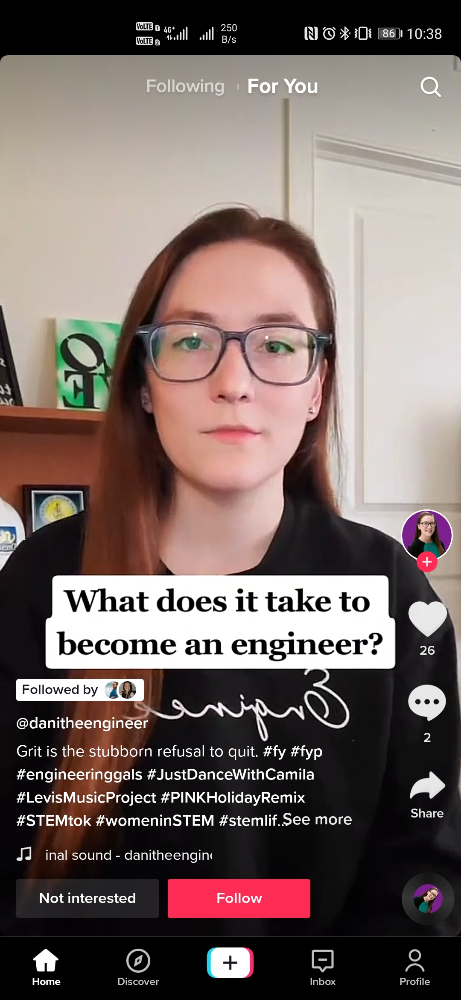
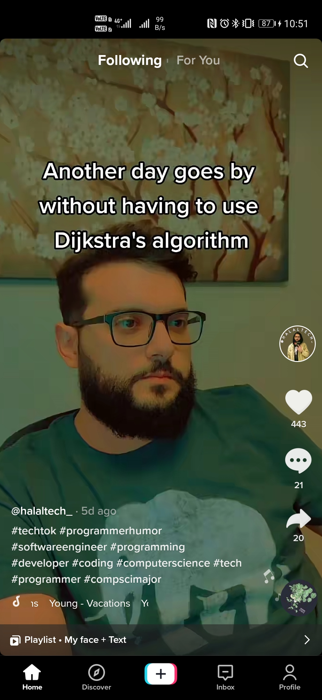

# Using Tiktok to Reach a New Developer Audience

<!--

Hello everyone, welcome to using TikTok to reach a new developer audience. 

Today we going to take a very brief look at what TikTok is, and why you should be using it as part of your DevRel content creation!

-->

---

# Who am I?

- Lead Developer Advocate for Huawei's AppGallery Connect
- Android Developer for 10 years
- Moved into DevRel and never looked back!
- Content first approach

<!-- 
But first a quick look at who I am and my history.

Was an Android developer for 10 years

By chance fell into a DevRel role, was looking for my next android position, and was contacted by a recruiter for DevRel. Didn't know anything about DevRel but after diving into the interview process and learning all about it I realised something.

I can be paid for the things I enjoy most?!

So I started as a developer advocate for AppGallery, Huawei's app marketplace. After a few months, this transformed into being the lead as the team expanded.

I take a content first approach to my advocacy, I find that interactions via social media can quickly foster good relationships and real connections with developers and communities.

-->

---

# What is TikTok?

- Video focused social network
- Short form videos (15 seconds, 60 seconds, 3 minutes)
- Uses algorithms to present videos to user
- Younger audience

<!--
Unless you have been living under a rock im sure you have at least heard of the social network TikTok.

But what is it?

Video focused social network that allows you to create short videos directly within their app. These videos are put into three lengths, up to 15 seconds, up to 60 seconds or up to 3 minutes.

What makes Tiktok particularly interesting is how it presents videos to its users. By using the For you page, or FYP the user is presented with one video at a time.

They swipe up to see the next video and continue on and on. What this means is at the moment a user sees your video your video i the only thing they are seeing.

This is what sets it apart from other traditional social networks where you might have many posts on the screen at any one time.

From the fyp a user can like the video, comment or share it. The user can also click on your profile icon to see more of your content or click to follow you.

The other screen the user can view content from is the "Following" tab, this only shows videos from people you are following but otherwise is the same interface.

TikTok does appeal to a younger audience, with around 40% of users being between the ages of 16 and 24
-->

---

# Developers? On TikTok? What?

- Students moving into a career
- Software development on the rise
- Students turn to the social media they know for help 
- @liz.kenyon - 55k followers
- @misodope - 259k followers
- @icathryn - 238k followers

<!--

It's no longer all silly dances and skits... although those are still very much about.

However, there is a new growing developer community but where did the come from?

As we have said TikTok is massive with the younger audience.. the audience who are moving into college, university, and thinking about their career path.

Many of them are, understandably turning to software development! 

And.. what do we all do when we get stuck with something? We use social media to ask for help or learn. 

And the social media that these people are used to using? That's right TikTok!

Because of this, there is a massive growth in developers using TikTok, both to learn and to share knowledge. 

The developer hashtag for example as 384.8 million views

The software engineer hashtag has 542 million views

Here we have just a couple of examples of tech and developer based profiles with impressive followings.

-->

---

# How to 'TikTok'

- Very easy process, create video, edit, publish
- Use useful hashtags
- Use treading audio when it fits
- First few seconds most important

<!--

The actual process of creating a TikTok video is very easy. You click the centre button in the bottom navigation bar.

You record, you apply any editing you want and then you publish it.

We won't go into details of the mechanics today but what we will talk about is how we can make a successful TikTok video.

I will however mention that you can now also upload videos via TikTok's webpage. You don't get all the fancy in-app editing they offer BUT this is very useful for a team account or if you are more used to editing in a desktop application.

As I mentioned which videos get shown to a user is completely decided by the algorithms TikTok uses. TikTok tracks what content a user likes, comments on, watches all the way and then compiles a profile based on that. 

From there TikTok will show content it thinks matches that profile.

When you create a video it's sent out to a small group of people, around 10. These are people TikTok thinks will like that video. 

If they do like it, by either watching the whole video, commenting, sharing or clicking the like button TikTok will know it most likely got its understanding of the video correct.

It will then send your video to another larger group of people, slowly increasing the videos reach and range until TikTok decides people are no longer interested.

This is why it's so important to craft the video and its metadata in a way that TikTok can correctly identify who should be watching that video.

And in a way that will make users want to engage with the video.

Firstly make sure that your video has correct hashtags, these are used by TikTok to understand the content of the video but are also searchable by users. 

Generic hashtags like developer, software engineer, codetok are useful but also use more specific tags, if you're talking about a certain programming language, or tool include it as a hashtag!

Another useful feature is being able to overlay audio from another video into your video. If for example there is a funny trending sound this can be used to boost viewer numbers.

Finally without a doubt the most important thing. Make sure your video has a hook, you have at most a couple of seconds to get someone interested in watching your video before the swipe and goes into the next video.

Make sure you from the outset grab the users attention. 

"My 5 unpopular views on Android development" is cheesy but it works!

As an example, I have over 1500 followers but if I create a video with no tags, no description, and the video is slow to start.. it will flat out get less than 50 views without a doubt.

However correctly tagging the video, adding a short description and making sure there is a strong hook to the video I will get between 100 - 300 views every time. 

If the video is particularly well crafted, it's very entertaining or interesting getting over 1000 views is easily done.

--->

---

# Content Buckets

- Funny, Entertaining
- Q&A
- Informative

<!--
So we know how to make a TikTok video, we know the general things we need to do to make it successful... but what content should we be making?

We can break the types of content that does well on TikTok into three content buckets.

First, we have the funny or entertaining videos, these will normally be the shortest, around 15 seconds and be some kind of meme or quote. 

Often taking popular audio and applying it in some funny way to the developer world. 

This bucket would also include more traditional content like dancing etc.. personally not something I do but you might want to get into some TikTok dances!

Then we have the Q&A bucket. One feature of TikTok is it allows creators to reply to a comment on a video with another video. This allows users to ask a question and then have it answered in the form of a video.

This is a super engaging way to generate views and interaction, people love to be able to ask and get real answers! 

Finally, we have the informative bucket. These of course could also be seen as being entertaining, but their focus is on providing information to the user. 

This might be explaining a new feature, or how to do something in a specific programming language. These will typically be longer, but if done well will get a lot of interaction and traction.

So how much of each bucket should you do? Well, most importantly you need to be consistent with your videos, posting daily.

If possible the best rate seems to be three videos a day. 

As soon as you stop posting, TikTok very quickly stops showing your videos to people. So even if you cant do three a day aim for at least one video a day.

I aim to do one video from each bucket each day. Although this can change, some days I might do two entertainment posts and one informative. Or I might have a day where I just do Q&A if I have a lot of questions to answer.

-->

---

# Examples

<video src="videos/Funny-1.m4v" controls style="height:500px;float:left;padding-right:10px"></video>
<video src="videos/Qa-Php-1.m4v" controls style="height:500px;float:left;padding-right:10px"></video>
<video src="videos/Infomative-Cli-1.m4v" controls style="height:500px;float:left;"></video>

<!--

So we have looked at the different types of content and how we might produce a successful video,  let us take a quick look at a few of my less embarrassing TikTok videos as examples.

First up is a short meme, taking a currently popular audio clip and applying it to the world of coding! 

Here we have used a text overlay for the joke.

Then an example Q&A video, we won't watch the whole thing but you can see how this kind of video is played out.

the question that was asked as a comment is overlayed on the video.

Finally an information video, part of the Acronym of the day series I do both on Twitter and on TikTok where I aim to explain a tech acronym in less than 60 seconds... some much easier than others!

-->
---

# Content Reusablity

- Blog post that becomes a video, that becomes a TikTok series

<!--

In the end, I feel that Tiktok can become part of any DevRel teams content routine.

Any video content you are already creating could easily become TikTok videos. 

This might be a series that breaks the whole video down into 60-second chunks.

Or perhaps one video that acts as a taster and encourages users to go and watch the full video.

-->

---

# Thank you!

 

https://www.polywork.com/devwithzachary

<!--

Finally if you would like to follow what up im up to please do check out my polywork profile which includes all my social links including oh yes tiktok!

-->