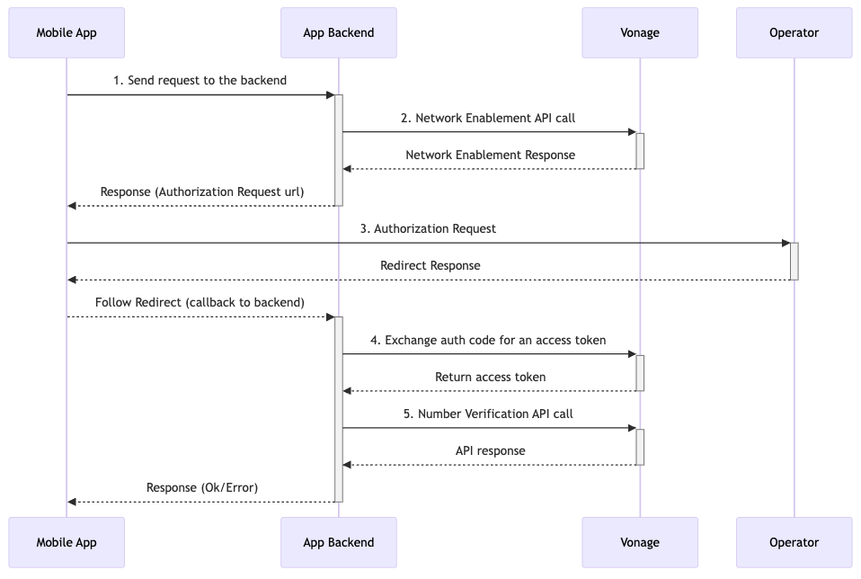

# Authenticate Your Users Like a Ninja 🥷
## Silent Authentication in Android Apps 🤖

---

# What is Authentication?

 

---

# Verifying a User's Identity

 

---

# Why does Authentication Matter?

 

 * Security
 * Personalisation
 * Access control

---

# Traditional types of Authentication

 

* Knowledge (Passwords, Security Questions)
* Possession (Phyical Devices)
* Inherence (Fingerprint, Facial Recongition)
* And lots more...

---

# Two Factor Authentication

 

Combining multiple authentication types together

---

# The Problem 

 

* Password fatigue
* Friction in user experience
* Security vulnerabilities

---

# The Solution

 

---

# Silent Authentication

 

---

# What is Silent Authentication?

 

* Authentication without explicit user interaction

---

# The Solution

 

* Seamless user experience
* Reduced login friction
* Increased security

---

# Vonage Number Verification API
## A Network API

 

---

# Vonage Number Verification API

Standalone Silent Authentication API. It verifies the phone number linked to the SIM card in the device connected to the mobile data network, without any user input.

---
 
# Vonage Number Verification API

 

* Camara Specification
* Uses a Three Legged OAuth process
* Currently Available In Germany and Spain
* More Operators being onboarded
* Network API Playground for testing
* Verify API for fallback

---

 

---

# Show Me the Code!

---

```kotlin
suspend fun sendLogin(url: String, phoneNumber: String): Result<String> {
    val client = OkHttpClient()

    val jsonBody = """{"phone": "$phoneNumber" """.trimIndent()
    val requestBody = jsonBody.toRequestBody("application/json".toMediaType())
    val request = Request.Builder()
        .url(url)
        .post(requestBody)
        .header("Content-Type", "application/json")
        .build()

    return withContext(Dispatchers.IO) {
        try {
            val response = client.newCall(request).execute()
            if (response.isSuccessful) {
                Result.success(response.body?.string().orEmpty())
            } else {
                Result.failure(IOException("HTTP error: ${response.code}"))
            }
        } catch (e: IOException) {
            Result.failure(e)
        }
    }
}
```

---

```kotlin

import com.vonage.clientlibrary.VGCellularRequestClient
import com.vonage.clientlibrary.VGCellularRequestParameters

suspend fun sendAuthRequest(url: String): Result<Boolean> {
    val params = VGCellularRequestParameters(
        url = url,
        headers = emptyMap(),
        queryParameters = emptyMap(),
        maxRedirectCount = 15
    )

    return withContext(Dispatchers.IO) {
        val response = VGCellularRequestClient.getInstance()
            .startCellularGetRequest(params, true)

        val status = response.optInt("http_status")
        val isVerified = response.optJSONObject("response_body")
            ?.optString("devicePhoneNumberVerified", "false")?.toBoolean() ?: false

        if (status == 200 && isVerified) {
            Result.success(true)
        } else {
            Result.failure(IOException("Verification failed"))
        }
    }
}
```

---

```kotlin
try {
    val loginResult = sendLogin(LOGIN_URL, phoneInput)
    loginResult.getOrThrow().let { jsonString ->
        val authURL = JSONObject(jsonString).optString("url")
        val authResponse = sendAuthRequest(authURL)
        if (authResponse.getOrThrow()) "Authentication successful"
            else "Failed to authenticate"
    }
} catch (e: Exception) {
    e.localizedMessage ?: "An error occurred"     
}
```

---

```js
app.post("/login", async (req, res) => {

  // store phone number to be used in the other route
  app.set('phone', phone);

  const data = {
    phone_number: phone, scopes: [fraud_scope], state: generateRandomString(20),
  };

  const headers = {
    Authorization: `Bearer ${JWT}`, "Content-Type": "application/json",
  };

  try {
    // Network Enablement API call
    const response = await makeFetchRequest(ne_uri, {
      method: "POST",
      headers: headers,
      body: JSON.stringify(data),
    });
    auth_url = { url: response.scopes[fraud_scope].auth_url }
    res.json(auth_url);

  } catch (error) {
    res.status(500).json({ error: error.message });
  }
});
```

---

```js
app.get("/callback", async (req, res) => {
  const { code, state, error: errorDescription } = req.query;

  // phone number has been previously stored
  phone = req.app.get('phone');

  try {
    // Exchange authorization code for access token
    const tokenResponse = await makeFetchRequest(camara_auth_uri, {
      method: "POST",
      headers: { "Content-Type": "application/x-www-form-urlencoded", Authorization: `Bearer ${JWT}`,
      },
      body: new URLSearchParams({
        code,
        redirect_uri: REDIRECT_URI,
        grant_type: "authorization_code",
      }),
    });
    const { access_token: accessToken } = tokenResponse;
```

---

```js
// Call Number Verification API
    const nvResponse = await makeFetchRequest(nv_uri, {
      method: "POST",
      headers: {
        "Content-Type": "application/json", Authorization: `Bearer ${accessToken}`,
      },
      body: JSON.stringify({ phoneNumber: phone }),
    });

    res.json(nvResponse);
  } catch (error) {
    res.status(500).json({ error: "Internal Server Error" });
 }
});
```

---

```json
{ devicePhoneNumberVerified: true }
```

---

# Run the Demo!

---


# Checkout Number Verification and Other APIs

Coupon Code, €10 free credit: <b>25LOND10</b>

developer.vonage.com


---

# Thank you!

 


links.zpweb.site

github.com/devwithzachary/presentations