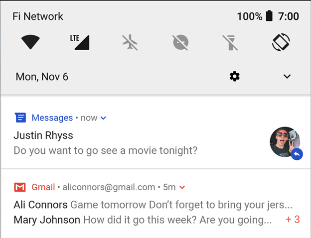
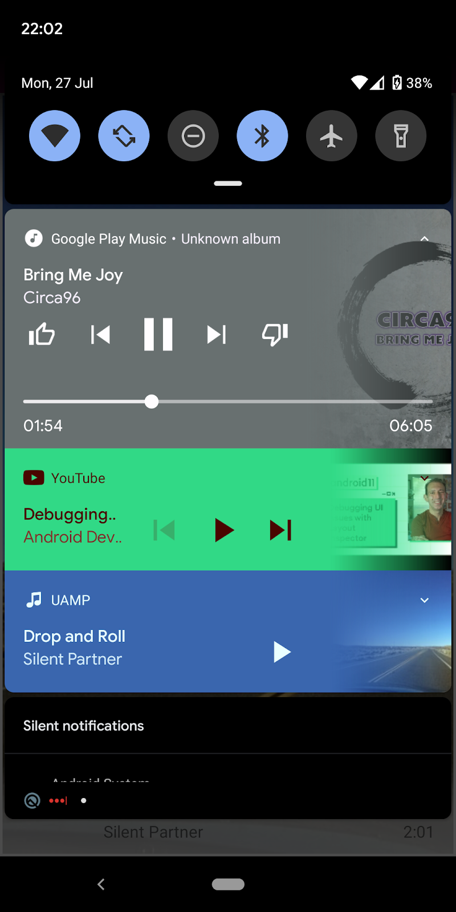

# Using Communication APIs to enhance your UX
And reduce notifications!

---

# Who am I?

- Sr Android Developer Advocate at Vonage
- Android Developer for 12+ years
- DevRel for 2 years
- Pet Dad


---

# Who am I?

- ~~Sr Android Developer Advocate~~ DevRel Manager at Vonage
- Android Developer for 12+ years
- DevRel for 2 years
- Pet Dad


---

## Android
# Other platforms are available


---

## Takeaways

* History of notifications on Android
* Why today notifications suck!
* What are communication APIs?
* How might you use them in your applications?


---

# In the beginning there was... notifications!


---

## It was great!

# Quick access to important information


---

## It was great!

# Push content to users while the app is closed



---

## It was great!

# Access to controls for music apps.



---

# Look at your phone. 
# How many notifications do you have right now?

---

# <!--fit--> 5?

---

# <!--fit--> 10?

---

# <!--fit--> 32767?

---


---

## Then it wasn't great.

# Users bombarded with notifications. **Avg 46 per day**

 <font size=3> Source: Businessofapp.com</font> 


<!--
Stats source: https://www.businessofapps.com/marketplace/push-notifications/research/push-notifications-statistics/
-->
---

## Then it wasn't great.

# Notifications treated like spam. **Reaction rate 4.6%**

 <font size=3> Source: Businessofapp.com</font> 


<!--
Stats source: https://www.businessofapps.com/marketplace/push-notifications/research/push-notifications-statistics/
-->
---

## Then it wasn't great.

# UX nightmare


---

## Control is Yours!

# Android introduces ways for users to mute/stop notifications


---

## Control is Yours!

# Great UX! But at what cost?


---

## Terrible for Developers

# Users completely shut off notifications


---

## Terrible for Developers

# Can't rely on notifications for important stuff!


---

## Notifications for less important stuff

# Info that may or may not be seen by the user


---

## Notifications for less important stuff

# Become used even more for 'spam'


---

## But what about the important stuff?

# When you need a user to action something


---

## But what about the important stuff?

# Time sensative infomation


---

## But what about the important stuff?

# Start a Conversation Flow


---

## Conversation Flow

# Send notification, pray the user sees it


---

## Conversation Flow

# Wait until they open the app (may or may not be 10+ years)


---

## Conversation Flow

# Start conversation


---

## Not a good User Experience

# Slow


---
## Not a good User Experience

# Requires a lot of steps


---
## Not a good User Experience

# May or may not be actioned


---
## Not a good User Experience

# What happens when the app isn't installed?


---

## How do we improve this?

# Better guarantee the user sees important info


---

## How do we improve this?

# Quickly start interactive conversations


---

## Communication APIs

# A way to provide new experiences


---

## Communication APIs

# Platform independent


---

## Text

# Send and receive Text Messages via code


---

## Voice

# App to App, App to Phone, Text to Speach


---

## Video

# Screen sharing, live streaming, meetings


---

# Vonage Communication APIs


---

# SDKs


---

# Restful APIs

```
curl -X "POST" "https://rest.nexmo.com/sms/json" \
  -d "from=$VONAGE_BRAND_NAME" \
  -d "text=A text message sent using the Vonage SMS API" \
  -d "to=$TO_NUMBER" \
  -d "api_key=$VONAGE_API_KEY" \
  -d "api_secret=$VONAGE_API_SECRET"
```

---


# Use Case - SMS Alerts

* Avg open rate **99%**
* Users select and receive important alerts
* Direct and actionable via in app linking

 <font size=3> Source: redeye.com</font> 


<!--
Stat source https://www.redeye.com/resources/sms-marketing-vs-email-marketing-who-wins-the-battle-for-effectiveness/
-->

---


# SMS Alerts 

* Stock alerts for high demand items
* User signs up via an app
* Selected SMS alerts
* Direct alerts sent even if the app is no longer installed


<!--
Stat source https://www.redeye.com/resources/sms-marketing-vs-email-marketing-who-wins-the-battle-for-effectiveness/
-->

---

# SMS Alerts - NodeJS

```javascript
const from = VONAGE_BRAND_NAME
const to = TO_NUMBER
const text = 'PS5 is now in stock!'

await vonage.sms.send({to, from, text})
.then(resp => { 
    console.log('Message sent successfully'); 
    console.log(resp); 
})
.catch(err => { 
    console.log('There was an error sending the messages.'); 
    console.error(err); 
});
```

---

# Voice Help Desk

* Museum has a physical phone help desk
* Calling in foreign countries is expensive


---

# Voice Help Desk

* Build the "call" button into the app
* Audio call within the app
* User never leaves your app
* Process doesn't change 


---

# Voice Help Desk - Kotlin

```kotlin
var client = NexmoClient.Builder().build(this)
client.login("JWT")
client.serverCall("PHONE_NUMBER", 
    null, 
    object : NexmoRequestListener<NexmoCall> {
        override fun onSuccess(call: NexmoCall?) {}

        override fun onError(apiError: NexmoApiError) {}
    }
)
```

---

# In App Video Doctor

* Enable virtual 1:1 with doctor
* Doctor can see many more patients
* Still able to provide visual diagnosises


---

# In App Video Support

* User signs up to virtual doctor app
* Can book and directly video within the app
* User never leaves app


---

# In App Video Support - Kotlin

```kotlin
private val sessionListener: Session.SessionListener = object : Session.SessionListener {
    override fun onConnected(session: Session) {
        publisher = Publisher.Builder(activity).build()
        session.publish(publisher)
    }
    override fun onStreamReceived(session: Session, stream: Stream) {
        if (subscriber == null) {
            subscriber = Subscriber.Builder(activity, stream).build()
            session.subscribe(subscriber)
        }
    }
    override fun onStreamDropped(session: Session, stream: Stream) {
        if (subscriber != null) {
            subscriber = null
        }
    }
}
session = Session.Builder(activity, apiKey, sessionId).build()
session?.setSessionListener(sessionListener)
session?.connect(token)
```

---


# Reducing notifications


---

# Maximise Engagement


---

# Get started!

## Sign up at developer.vonage.com


---

# Thank you!

 


polywork.com/devwithzachary

<font size=5>github.com/devwithzachary/presentations</font>