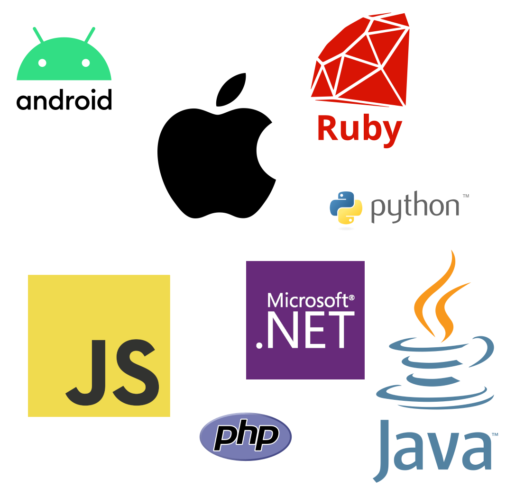
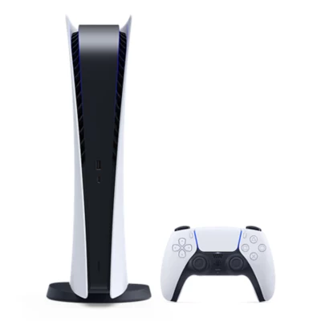

# Using Communication APIs to enhance your UX
And reduce notifications!

---

# Who am I?

- Sr Android Developer Advocate at Vonage
- Android Developer for 12+ years
- Keep getting pulled into Telecommunications!
- Warhammer enthusiast


---

# In the beginning there was... notifications!


---

# It was great!

* Quick access to important information
* Push content to users while the app is closed
* Access to controls for music apps.


---

How many notifications 
do you have right now?


---

# Then it wasn't great.

* Users bombarded with notifications. **Avg 46 per day**
* Notifications treated like spam. **Reaction rate 4.6%**
* UX nightmare

 <font size=3> Source: Businessofapp.com</font> 


<!--
Stats source: https://www.businessofapps.com/marketplace/push-notifications/research/push-notifications-statistics/
-->
---

# Control is Yours!

* Android introduces ways for users to mute/stop notifications
* Great right?


---

# Terrible for Developers

* Users completely shutting off notifications for apps
* No longer able to make sure users get important information


---

# Notifications for less important stuff

* Info that may or may not be seen by the user


---

# But what about the important stuff?

* When you need a user to action something
* Starting a conversation


---

# Conversation Flow

* Send notification, pray the user sees it
* Wait until they open the app (may or may not be 10+ years)
* Start conversation (Bot, direct user to live chat, phone number)


---

# Not a good User Experience

* Slow
* Requires a lot of steps
* May or may not be actioned
* What happens when the app isn't installed?


---

# How do we improve this?

* Better guarantee the user sees important info
* Quickly start interactive conversations


---

# Communication APIs

* A way to provide new experiences
* Platform independent
* Add communication channels to your application


---

# SMS

* Send and receive SMS via code
* Create bot flows via text


---

# Voice

* App - App
* App - Phone
* Phone - App
* Automated Text to Speach


---

# Video

* 1 to 1 Video
* Multi Video
* Meetings
* Screen sharing


---

# Vonage Communication APIs


* Voice, Video, SMS etc.
* Self-service


---

# SDKs



---

# Restful APIs

```
curl -X "POST" "https://rest.nexmo.com/sms/json" \
  -d "from=$VONAGE_BRAND_NAME" \
  -d "text=A text message sent using the Vonage SMS API" \
  -d "to=$TO_NUMBER" \
  -d "api_key=$VONAGE_API_KEY" \
  -d "api_secret=$VONAGE_API_SECRET"
```

---


# Use Case - SMS Alerts

* Avg open rate **99%**
* Users select and receive important alerts
* Direct and actionable via in app linking

 <font size=3> Source: redeye.com</font> 


<!--
Stat source https://www.redeye.com/resources/sms-marketing-vs-email-marketing-who-wins-the-battle-for-effectiveness/
-->

---


# SMS Alerts 

* Stock alerts for high demand items (PS5)
* User signs up via an app
* Selected SMS alerts
* Direct alerts sent even if the app is no longer installed



<!--
Stat source https://www.redeye.com/resources/sms-marketing-vs-email-marketing-who-wins-the-battle-for-effectiveness/
-->

---

# SMS Alerts

```java
TextMessage message = new TextMessage(VONAGE_BRAND_NAME,
    TO_NUMBER,
    "A text message sent using the Vonage SMS API"
);

SmsSubmissionResponse response = client.getSmsClient().submitMessage(message);

if (response.getMessages().get(0).getStatus() == MessageStatus.OK) {
    System.out.println("Message sent successfully.");
} else {
    System.out.println(response.getMessages().get(0).getErrorText());
}
```

---

# Voice Help Desk

* Build the "call" button into the app
* Audio call started from within the app
* User never leaves your app


---

# Voice Help Desk

* Museum has a physical phone help desk
* Calling in foreign countries is expensive
* Free for the user
* Process doesn't change 


---

```kotlin
var client = NexmoClient.Builder().build(this)
client.login("JWT")
client.serverCall("PHONE_NUMBER", 
    null, 
    object : NexmoRequestListener<NexmoCall> {
        override fun onSuccess(call: NexmoCall?) {}

        override fun onError(apiError: NexmoApiError) {}
    }
)
```

---

# In App Video Doctor

* Enable virtual 1:1 with doctor
* Doctor can see many more patients
* Still able to provide visual diagnosises


---

# In App Video Support

* User signs up to virtual doctor app
* Can book and directly video within the app
* User never leaves app


---

```kotlin
private var session: Session? = null
private var publisher: Publisher? = null
private var subscriber: Subscriber? = null

private val sessionListener: Session.SessionListener = object : Session.SessionListener {
    override fun onConnected(session: Session) {
        publisher = Publisher.Builder(activity).build()
        session.publish(publisher)
    }

    override fun onDisconnected(session: Session) {}

    override fun onStreamReceived(session: Session, stream: Stream) {
        if (subscriber == null) {
            subscriber = Subscriber.Builder(activity, stream).build()
            session.subscribe(subscriber)
        }
    }

    override fun onStreamDropped(session: Session, stream: Stream) {
        if (subscriber != null) {
            subscriber = null
        }
    }

    override fun onError(session: Session, opentokError: OpentokError) {}
}

session = Session.Builder(activity, apiKey, sessionId).build()
session?.setSessionListener(sessionListener)
session?.connect(token)
```

---


# Reducing notifications


---

# Maximise Engagement


---

# Get started!

* Join us at the Vonage booth! 
* Sign up at developer.vonage.com


---

# Thank you!

 


polywork.com/devwithzachary

github.com/devwithzachary/presentations