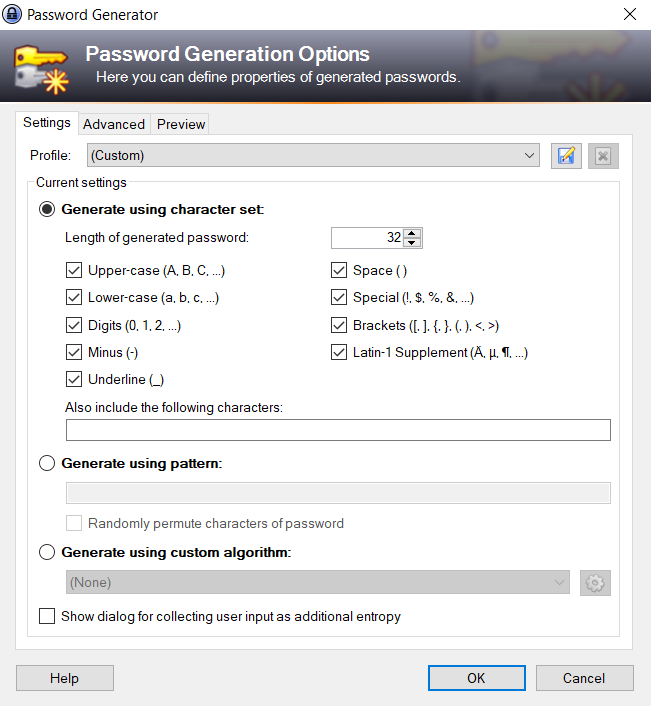
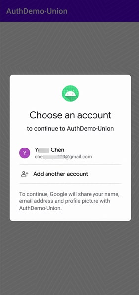

# Flexiable Cross Platform User Authentication with Huawei's AppGallery Connect

<!--

Hello everyone, I'm Zachary Powell, lead developer advocate for Huawei's AppGallery Connect.

Today we are going to take a look at a problem we have all faced as developers.

How do we provide a secure, reliable way to authenticate that a user is who they say they are...

AND make sure its user friendly and quick!

-->

---

# The Dark Ages

Username/Password

<!--

For quite sometime when you needed to authenticate a user, 
allow them to log in to a system you would use usernames and passwords.

Simple enough for the user to do! 
Just use the same username everywhere and think of a random word to use as your password.

What could go wrong?

-->

---

# The Dark Ages

Data leaks


<!--

Turns out.. a lot can go wrong.

As web-connected services became more popular so did hacking web-connected services.

Suddenly it was very easy for a hacker to take the leaked data from one service and use that information to log in to every service you used.


-->

---

# The Dark Ages

Password Stength



<!--

Ok! So what do we do about passwords? Well, we force the users to create more complex passwords of course.

We require certain character lengths, combinations to make the passwords more secure.

But in doing so bye-bye goes the ease of access.

Suddenly a user has a million passwords to remember, all different and all with different requirements.

So how can we make things a little simpler but still secure?


-->


---

# 2fa or not 2fa

That is the question.


<!--

Of course, we reach a point where just having a secure password isn't enough.

Computers are very good at brute force methods to decrypt a password, traffic could be sniffed or users details captures via other means. Keyloggers, phishing attempts etc.

So how do we as developers make sure that the user IS who they say they are?

Enter two-factor authentication! 

Using some other external means, an email, text message, physical key generator we can add an extra laugh of authentication to make sure that even if a hacker did get a users details they still can't get into the account.

And this is great! But again add another layer of requirement on the user, it's another thing to have to remember.

-->

---

# Lets get Social


<!--

What is the one thing nearly all internet users have? Some form of social media. 

Social media that more often than not is constantly logged in and being used on whatever device the user is using.

What better way to authenticate someone than by using something they have already logged into?

The user simply clicks a button and boom they are logged into your app using their social media of choice.

It's a great way to provide a good UX and not have to worry about the actual authentication.. just let someone else worry about it!

Win-win right?

Well... Yes.. but how do you decide which platforms to support?

What about the users who don't have social media?

How do you make sure a user trusts you enough with their social media details?


These are the issues we face when dealing with authentication. It's not a size fits all, we have to give the user a range of options to let their device what works for them.

That can be a real pain to manage, to keep all those SDKs working and up to date.

-->

---

# Huawei's AppGallery Connect Auth Service

Android, iOS, Web

<!--

This is where something like Huawei's AppGallery Connect Auth Service can come into play!

The provided SDK allows you to create a uniformed cross-platform framework for user authentication.

The SDKs are provided for Android (not just Huawei phones!), iOS and the Web.

We also have support for Flutter, React Native and Cordova.

This means in most cases you can use the single SDK for every platform your application supports.

-->

---

# Authentication Options

Mobile number, Email Address, Anonymous, Own system, Apple, Google, Facebook, Twitter + More!

<!--

While it's very important to support many platforms, as we have talked about it's also very important to be able to give the user the options they want to use to authenticate.

That's why the Auth Service supports a huge range of options, each easily enabled and implemented into your application.

From first-party options like mobile numbers, email addresses to third-party options like Apple, Google and Facebook the service has you covered!

Plus if there is a service you need to use that isn't supported? OR you have the authentication methods you need to support, perhaps for legacy reasons these too can easily be integrated into the system.

Let's take a quick look at how a couple of these work.

-->

---

# Anonymous

```kotlin
AGConnectAuth.getInstance().signInAnonymously().addOnSuccessListener {
    // onSuccess
    val user = it.user
}.addOnFailureListener {
    // onFail
}
```

<!--
Anonymous accounts are one of the simplest setups you can use.

They are super useful if you just need a way to identify a particular user and links activities to that user.

If you don't need to actually register any details of a user but still want to assign an identity to that person then this is the way to go.

As you can see it's as simple as calling the sigh in anonymous method, and boom you have a user object. 

-->

---

# Email - Verify Code

```kotlin
val settings = VerifyCodeSettings.newBuilder()
        .action(VerifyCodeSettings.ACTION_REGISTER_LOGIN)        
        .sendInterval(30)        
        .build()
val task =  AGConnectAuth.getInstance().requestVerifyCode(email, settings)
task.addOnSuccessListener {
    // onSuccess
}.addOnFailureListener {
    // onFail
}
```

<!--

Many people still want to simple signup and login using an email address, and of course, there is full support for this.

But as a developer, we want to make sure that the email address the user has entered is correct, and is owned by them.

So to allow email signup we first request a verification code. The user enters their email and we run this simple method to send a verification code to that address.

-->

---

# Email - Register 

```kotlin
val emailUser = EmailUser.Builder()
        .setEmail("your Email")
        .setVerifyCode("verify code")
        .setPassword("your password")
        .build()
AGConnectAuth.getInstance().createUser(emailUser).addOnSuccessListener {
    // After an account is created, the user has signed in by default.
}.addOnFailureListener {
    // onFail
}
```

<!--

Then the user enters that code into the app and we can then build an email user.
Adding their email address, code and optionally a password. 

This then lets us register that user and we are signed in with a valid user object once more.

-->

---

# Email - Login with Password 

```kotlin
val credential = EmailAuthProvider.credentialWithPassword("your Email", "password")
AGConnectAuth.getInstance().signIn(credential).addOnSuccessListener { 
    val user = it.user
}.addOnFailureListener {
    // onFail
}
```

<!--
Now as i mentioned the password in this instance is actually optional. 

So we can provide the user with two different ways to signin to their account once they have registered with an email address. 

The simple method would be using email and password, as we menthioned this is less secure than other methods but might still be all thats needed for an app that only requires basic security.
-->

---

# Email - Login with Verify code 

```kotlin
val credential = EmailAuthProvider.credentialWithVerifyCode("your Email", "password","verify code")
AGConnectAuth.getInstance().signIn(credential).addOnSuccessListener { 
    val user = it.user
}.addOnFailureListener {
    // onFail
}
```

<!--
The other option is the use of a verify code, so we would use the same code we saw as part of the signup process to request a verification code be emailed to the user.

Once they have that code they enter this into the app and we pass that into this with verifying code method. For added security, we can still require the password here as well.
-->

---

# Sign in With Google

```xml
<string name="google_app_id">5758********</string>
<string name="google_client_id">5758********.apps.googleusercontent.com</string>
```

<!--

Of course, as we mentioned a sign-in option a lot of people do like is being able to sign in via some social service that they are already logged into.

A wide range of these services are supported but for this demo, let's take a quick look at how we can sign in via a Google account.

Yes, that is right! Even if your Android device doesn't have Google mobile services you can use the Auth service and have support for login via Google!

We start by going over the normal setup for enabling a google service, registering on Google for an app id, and a client id.

-->


---

# Sign in With Google


```kotlin
AGConnectAuth.getInstance()
.signIn(this, AGConnectAuthCredential.Google_Provider)
.addOnSuccessListener {
    val user = it.user
}.addOnFailureListener {
    
}
```


<!--

Then we can simply use the sign-in method passing the google provider to enable this sign-in process. 

The user is presented with a UI that they recognise just like this, they can select their google account or log in to a new one.

As the developer, none of this has to be managed all we have to worry about is checking if sign-in was successful, in which case we will have a user object again.

Or if it failed we can handle the failure as we see fit.

-->

---

# Own System Authentication

```kotlin
val credential = SelfBuildProvider.credentialWithToken(token)
AGConnectAuth.getInstance().signIn(credential).addOnSuccessListener {
    // onSuccess
    val user = it.user
}.addOnFailureListener {
     // onFail
}

```

<!--

Perhaps you have your authentication system, maybe it's a legacy system so while new users will register via the Auth service, older accounts might need to authenticate via your process.

How do we tie this into the auth service?

Well, we can use something like this method to create a user via some authentication token.

As an example, your login system might authenticate the user and then produce a JWT which would have been used in your application. Well now instead of just using that token pass it into the builder.

This will allow you to then sign in using your token and create a user within the Auth service, just the same as if the user had logged in any other way.

-->

---

# Account linking

```kotlin
AGConnectAuth.getInstance().currentUser.link(this, Google_Provider).addOnSuccessListener {
        // onSuccess
        val user = it.user
}.addOnFailureListener {
        // onFail
}
```

<!--

One final thing, what if a user wants to be able to log in via different methods, maybe they signed up in your application via the old legacy system. But now they want to be able to log in via their Google account?

Well, this is completely possible using Account Linking.

Once the user has logged into their currently support login method they can then add new login methods.

Take the example here, we get the current logged in user, perhaps they logged in via email or using your system.

Then we call the link method passing in the provider we want to use, in this case, Google.

Then just like the sign in with google screen, we saw before the user would be presented with the dialogue to login with their google account.

When this is successful we now have their google account linked back to their already existing user.

This is a really powerful feature because it gives the user the freedom to pick which authentication options they do want to use. 
-->

---

# Thank you!

 

https://www.polywork.com/devwithzachary
