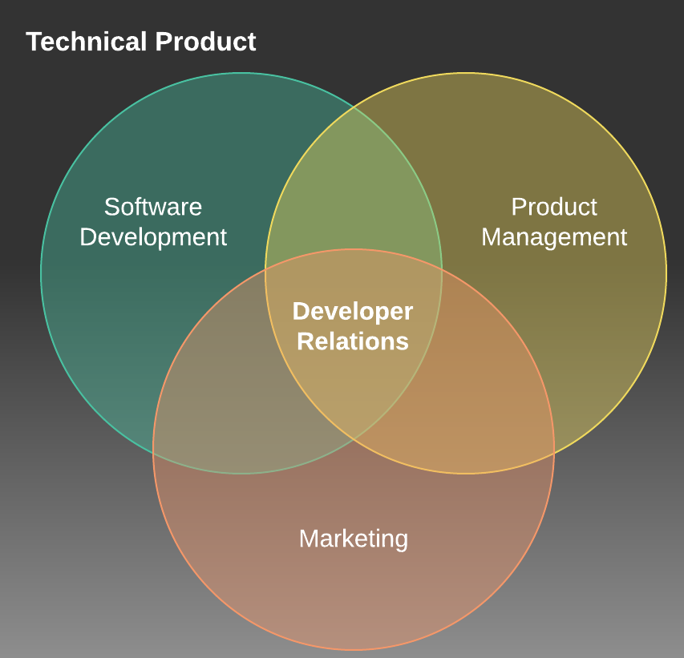

# Developer Advocacy: Or How I stopped worrying about public speaking and learned to love documentation.

---

# Who am I?

- Lead Developer Advocate for Huawei's AppGallery Connect
- Android Developer for 10 years
- Move into DevRel and Never looked back!

<!-- 

Breif about me, why am i worth listening to?

Android developer for 10 years after Uni

By chance fell into a DevRel role

Started new DevRel team for AppGallery Connect

Explain what AppGallery and AppGallery Connect is

Moved to lead and never looked back!

-->

---

# DevRel - Developer Relations

## Where Where Marketing, Developers and Product Managers meet

https://medium.com/@edshee/developer-relations-explained-c1cce2ea53a8

<!--
Where Software Development, Marketing and Product Management meet

NOT a sales role

Strong technical background. Marketing with a developer focus.
-->

---

# DevRel - Developer Relations

## Code, Content, Community

<!-- 

But what do we actually do?

The three C's, code, content, community.

The Code. We developer sample applications, sample code snippets and projects to show case HOW to use a product.

The Content, produce documentation, Blog posts, videos, demo labs, presentations about the product.

The Community, help build and grow a community of developers, be active on social media, form discord, slack groups.

-->

---

# DevRel - Developer Relations

## Contecting Internal Developers with External Developers

<!-- 

Most importantly Work to connect the internal developer teams of a product with the external developers that use the product. 

-->

---

# DevRel - Developer Relations

## What kind of Company has DevRel?

<!--

Who has DevRel? Typicaly it will be a tech company that has some product, tool, sdk, platform that they want developers to be using.

Fits in with all types of developer work from Cloud computing to Game engines. 

Traditionally larger companies would have the budget for Devrel, however a growing number of start ups are seeing an importance to build DevRel early.

Might be working on your own handling all DevRel or part of a much larger world wide team made up of Community managers, Developer Evangelists, Developer Advocates, Technical writers etc.

-->

---

# Developer Advocate

## Cornerstone of DevRel

<!--

Often the first hire in DevRel

As the name suggests they are Advocating for developers.

Both ways, advocating for the users of a product back to the company and internal teams.

Advocating FOR a product to external developers.

-->

---

# Developer Advocate

## Help developers be successful with the tools a company offers

<!--

Ultimatly the goal is to help developers be successful with the tools and products a company is offering.

Includes much of what we have already talked about including the three C's

The important of each might change and adjust depending on the type of company and type of tools.

A company might have a very very small market and have no real need for community. BUT require alot of sample code and documentation.

Another company might have a huge community made up of 1000s of developers, have more of a focus on events and outreach.

-->

---

# Developer Advocate

## Make sure the wants of developers are communicated internally

<!-- 

The result will often be that you become a condiwit for infomation flowing in and out of the company.

You wil be there to help understand the needs of developers, what changes are needed to the product. What can be improved.

And also relay out infomation as changes are made back to the developer communities.

-->

---

# Why is it important

## Improves adoption of a product

<!--

Its been proven, time and time again then having a friendly accessible tech team improves adoption.

People want to use products that are well documented, and where there is a place they can go to for help.

Traditional marketing doesn't do this well. Its hard to preserve a sense of community if your driving factor is sales.

-->

---

# Why is it important

## Helps Developers feel listened to and cared about

<!--

When developers feel like their voice is heard good things happen. Communities grow.

People feel compelled to help and contibute back, start their own local community groups, write content etc.

-->

---

# Why is it important

## Bridges the gap between company and community

<!-- 

Within larger companies community efforts are often completely seperate from the company. 

They are run by volenteers.

DevRel bridges that gap and allows these communities to more easily work directly with the company.

-->

---

# Is it for me?

- Strong passion for community, presenting, organisation, social
- Enjoy working on a range of projects
- Have a real impact on a products journey

<!--

Do you have a passion for communities? Enjoy contributing to them? Presenting at events or even just attending?

Are you a Developer that likes to talk!?

Are you the kind of preson that cant stick to one project for to long? Want to be writing a presentation one minute 

Coding sample application the next? 

And of course do you want to have a real impact on a companys product, not just from a technical point of view?

Then DevRel might just be for you.

-->

---

# Why work in it?

## Massive growth in market

- 15% of DevRel teams now have over 100 members. Compared to just 1% in 2017
- Mid Size teams between 6 and 50 members grew from 5% to 9%

https://www.reverecommunications.com/post/state-of-developer-relations-2020-report

<!--

The market is growing massively

15% of DevRel teams now have over 100 members. Compared to just 1% in 2017

Mid Size teams between 6 and 50 members grew from 5% to 9%

Spreading out across the world. But still a strong footing in the US with over 50% of teams based there.

Constant stream of new jobs, very few people currently in the market.

-->

---

# Why work in it?

## Strong Salary Range

- US market average salary range is $125k - $175k
- Entry-level average $50k - $75k
- Mid-level average $75k - $150k
- Senior-level average $125k - $175k

<!--
Of course one important thing Im sure everyone is wondering, how much can you earn?

Well looking at a developer salary survery that was conducted during 2021 we can get some good ideas.

The US market is still the strongest on average with a range of $125k - $175k

But agree the world entry, mid and senior level posistions will still see a very strong salary

Entry-level average across the world $50k - $75k

Mid-level average across the world $75k - $150k

Senior-level average across the world $125k - $175k

With some senior positions reporting salaries well above $250k
-->
---

# Interested in More?

- https://www.forbes.com/sites/justinwarren/2019/08/14/what-is-developer-relations
- https://dev.to/bffjossy/2021-devrel-salary-survey-results-table-of-contents-43fe
- https://www.freecodecamp.org/news/what-the-heck-is-a-developer-advocate-87ab4faccfc4/

Slides can be found at https://github.com/devwithzachary/presentations

<!--

Thank you to everyone for listening, I hope you have found this interesting. If you do want some more details please do check out these links.

You can also find these slides on my github so you can grab the links yourself later on.

-->

---

# Thank you!

 

https://www.polywork.com/devwithzachary

<!--

Finally if you would like to follow what up im up to please do check out my polywork profile which includes all my social links and a timeline of events, podcasts, videos etc that I have been involved in!

-->