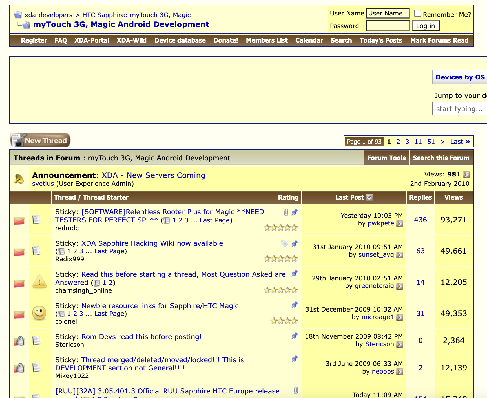
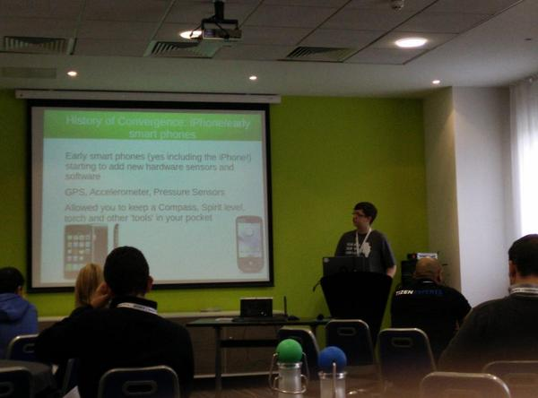
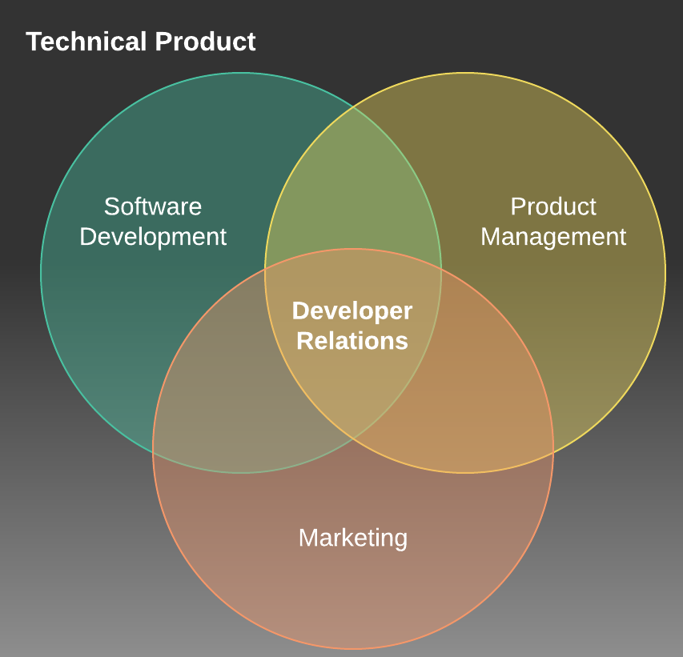
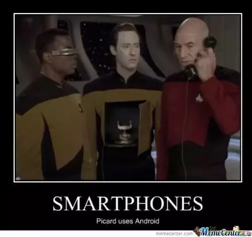

# From Developer to DevRel
How the Android community helped me grow

---

# Who am I?

* Sr Android Developer Advocate at Vonage
* Android Developer for 12+ years
* DevRel for 18+ months
* Pet Dad

---

# It all started with...

<!--
Can anyone beat me? Did anyone start older? G1?
-->

---

# XDA

* Launched in 2002
* Originally named after the O2 XDA
* Offered device-specific sub forums
* Exploded in popularity around Android

---

# Android Hacking

* Custom Android (ROMs)
* Theming
* Kernel Tweaks
* Root

<!--
Audienace: What was your first cyanogenmod version?
-->
---

# Thnks fr th Mmrs

* Stefanie Kondik - CyanogenMod
* Chainfire - Root
* Jerdog/Jeremy - Mentoring
* XDA moderators
* XDA Users

---

---

# How do you know they're the one?

* Amazing support and guidance
* Open and Free
* Collaboration
* Not Apple

---

# Shaped my Career

* University for CS + Game Design
* Android Community opened new options
* Networking

---

# Freelance

* 6+ years freelancing
* Moderator on XDA
* Events, Meetups, Conferences

---

# LinuxOnAndroid

* (GNU) Linux on Android devices via Chroot
* Personal project grew into a job
* Amazing support from community
* 1+ million downloads

---

# Move into DevRel

* Time for a change
* Discovering DevRel changed everything
* I was already doing it!
* Balance of Code and Community

---

# What is DevRel?

* Where Marketing, Developers and Product Managers meet
* Events
* Code
* Community
 Source: medium.com/@edshee 

<!--
https://medium.com/@edshee/developer-relations-explained-c1cce2ea53a8
-->

---

# Community³

* Not just XDA anymore (still great!)
* Socials (Twitter, TikTok)
* Discord servers
* Meetup groups
* Droidcon!!

---

# Get Involved!

* Attend Events ✔️
* Join social media communities
* Create content!
* Ask questions
* Help others

---

# Lessons learnt

* No such thing as dumb questions
* Huge wealth of resource
* Collaboration = Great Success
* Bricking phones sucks.

---

# Thank you!

 

www.polywork.com/devwithzachary

github.com/devwithzachary/presentations
