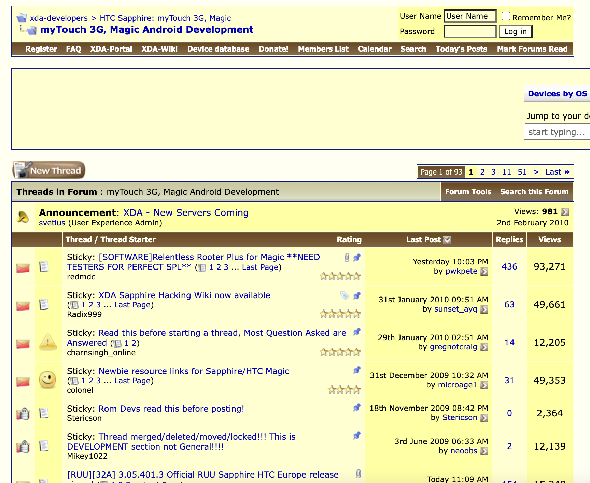
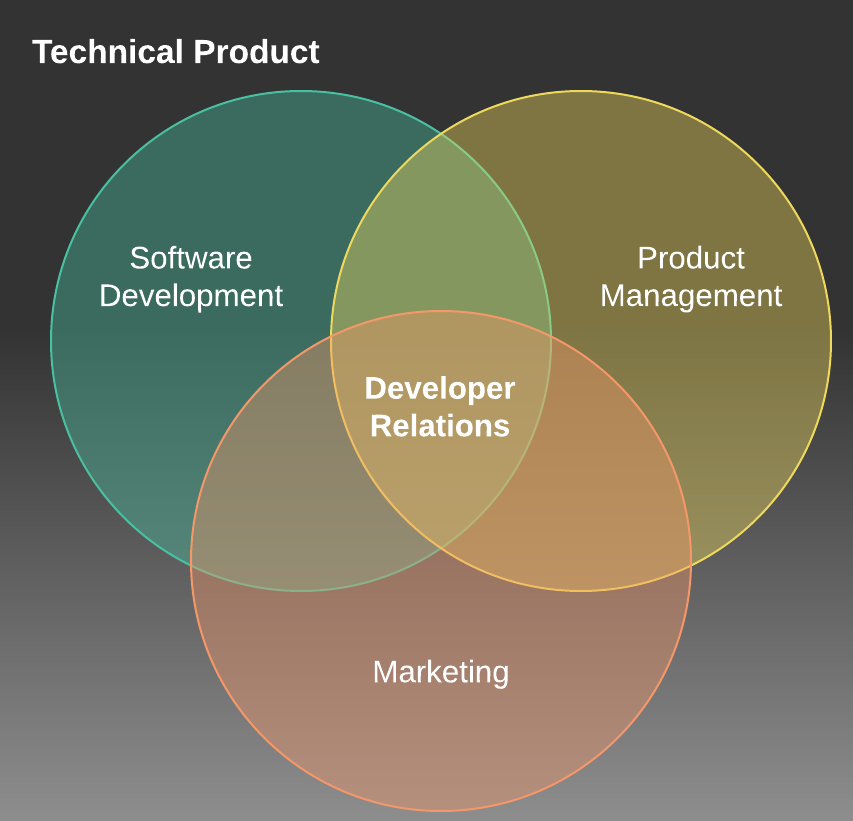
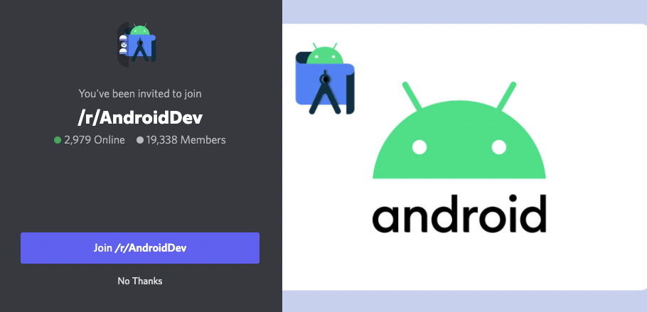
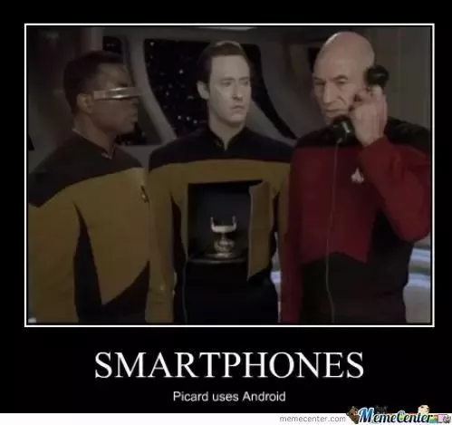

## From Developer to DevRel
# How the Android community helped me grow

---

## Who am I?

* Sr Android Developer Advocate at Vonage
* Android Developer for 12+ years
* DevRel for 18+ months
* Pet Dad

---

## The Past

# The early days of Android communities

---

## The Present

# Current community and DevRel!

(And memes)

---

## You

# How can you get involved? 
# Leasons learned!

---

## (for me)
# It all started with...

<!--
Can anyone beat me? Did anyone start older? G1?
-->

---

## XDA
# Launched in 2002

---
## XDA
# Originally named after the O2 XDA

--- 
## XDA
# Exploded in popularity around Android

---
## XDA
# Device specific sub forums

---
## Early Communities
# Early communities built out of "hacking"

---
## Early Communities
# App Development

---
## Early Communities
# Custom Android (ROMs)

---
## Early Communities
# Theming

---
## Early Communities
# Kernel Tweaks

---
## Early Communities
# Root

---

## How do you know they're the one?

* Amazing support and guidance
* Open and Free
* Collaboration

---

## How do you know they're the one?

# Not Apple

---

## Shaped my Career

# University for Computer Science + Game Design

---

## Shaped my Career
# Android Community opened new options

---
## Shaped my Career

# Networking

---

## Freelance

* 6+ years freelancing
* Moderator on XDA
* Events, Meetups, Conferences

---

## LinuxOnAndroid

* (GNU) Linux on Android devices via Chroot
* Personal project grew into a job
* Amazing support from the community
* 1+ million downloads

---

## Contracting

* Working with companies across the world!
* Building a tablet/desktop hybrid
* Amazing experience all because of Android

---

## Move into Developer Relations

# Time for a change

---
## Move into Developer Relations
# Discovering DevRel changed everything

---
## Move into Developer Relations
# I was already doing it!

---
## Move into Developer Relations
# Balance of Code and Community

---

## What is DevRel?

# Where Marketing, Developers and Product Managers meet

 Source: medium.com/@edshee 

<!--
https://medium.com/@edshee/developer-relations-explained-c1cce2ea53a8
-->

---

## What is DevRel?
# The three C's
# Code, Content, Community.

---

## What is DevRel?
# Content

---
## What is DevRel?
# Code

---
## What is DevRel?
# Community

---
## What is DevRel?

# Connecting Internal Developers with External Developers

---

## What is DevRel?

# Help developers be successful with the tools a company offers

---

## What is DevRel?

# Bridges the gap between company and community

---

## What is DevRel?

# Stickers

---

# DevRel in Nutshell

---

## Thnks fr th Mmrs

* Stefanie Kondik - CyanogenMod
* Chainfire - Root
* Jerdog/Jeremy - Mentoring
* XDA Moderators
* XDA Users

---

---

## Android Community Now
# Community³

---
## Community³
# Socials

---
## Community³
# Discord/Slack servers

---
## Community³
# Meetup groups

---
## Community³
# Events!

---

## Get Involved!

* Attend Events ✔️
* Join social media communities
* Create content!
* Ask questions
* Help others

---

# Lessons learnt

* No such thing as dumb questions
* Huge wealth of resource
* Collaboration = Great Success
* Bricking phones sucks.

---

# Thank you!

 

polywork.com/devwithzachary

github.com/devwithzachary/presentations
