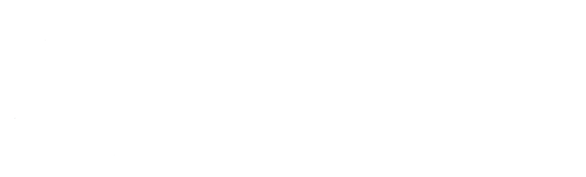

# Building a Kotlin Multiplatform Library in 10 Minutes. 
## Why Not?

---

# Zachary Powell
## Android Developer Since 2009
## Sr Android Developer Advocate
## Manager, DevRel at Vonage
@DevWithZachary

 

---

# Communication and Network APIs

 

---

# Libraries Libraries Libraries

* Android SDK
* Testing
* Dependency Injector
* Networking
* Plus many many more.....

---

# Application Programming Interfaces (APIs) 

* Third Party APIs 
* Internal APIs

---

# Consuming APIs manually sucks!

* Lacking Libraries 
* Missing Documentation
* Time consuming
* Ambiguity

---

# Lets fix that with.... Libraries!

---

<!-- _backgroundColor: red -->

# <span style="color:white; font-size: 180px;">!! WARNING !!</span> 
## <span style="color:white; font-size: 40px;"> Viewer Discretion Advised - Live Code Generation Ahead</span> 

---

 

---

 

---

 

---

# Have you heard of OpenAPI?

---

# Do you use OpenAPI?

---

# What is OpenAPI?

---

## What is OpenAPI?
"The OpenAPI Specification (OAS) defines a standard, language-agnostic interface to HTTP APIs which allows both humans and computers to discover and understand the capabilities of the service without access to source code, documentation, or through network traffic inspection." - https://swagger.io/specification/

---

## What is OpenAPI?

# OpenAPI Documents

---

## OpenAPI Documents

# Define Objects that Break Down your API Definition

* Meta Data
* Server Infomation
* End points
* Parameters....

---

# JSON

```json
{
  "title": "Sample Pet Store App",
  "summary": "A pet store manager.",
  "termsOfService": "https://example.com/terms/",
  "contact": {
    "name": "API Support",
    "url": "https://www.example.com/support",
    "email": "support@example.com"
  },
  "license": {
    "name": "Apache 2.0",
    "url": "https://www.apache.org/licenses/LICENSE-2.0.html"
  },
  "version": "1.0.1"
}
```

---

# YAML

```yaml
title: Sample Pet Store App
summary: A pet store manager.
termsOfService: https://example.com/terms/
contact:
  name: API Support
  url: https://www.example.com/support
  email: support@example.com
license:
  name: Apache 2.0
  url: https://www.apache.org/licenses/LICENSE-2.0.html
version: 1.0.1
```

---

# But Why?

---

## But Why?

# Define an API Contract between those building the API and those using it.

---

## But Why?
# The Tooling!

* Documentation
* Mocking
* Security
* Testing
* <b>Code Generation</b>
* openapi.tools

---

# Vonage SMS API

https://developer.vonage.com/en/api/sms

---
```json
"paths": {
      "/{format}": {
         "post": {
            "operationId": "send-an-sms",
            "summary": "Send an SMS",
            "description": "Send an outbound SMS from your Vonage account",
            "parameters": [
               {
                  "name": "format",
                  "description": "The format of the response",
                  "in": "path",
                  "required": true,
                  "schema": {
                     "example": "json",
                     "type": "string",
                     "enum": [
                        "json",
                        "xml"
                     ],
                     "default": "json"
                  }
               }
            ], ...
```
---

# OpenAPI Generator

https://openapi-generator.tech/

---

# Clients
ada, android, apex, bash, c, clojure, cpp-qt-client, cpp-restsdk, cpp-tiny, cpp-tizen,  cpp-ue4, crystal, csharp, dart, dart-dio, eiffel, elixir, elm, erlang-client, erlang-proper, go, groovy, haskell-http-client, java, javascript, jaxrs-cxf-client, jetbrains-http-client, jmeter, julia-client, k6, kotlin, lua, n4js, nim, objc, ocaml, perl, php, powershell, python, r, ruby, rust, scala, scalaz, swift-combine, swift5, typescript, xojo-client, zapier

---

# Clients
ada, android, apex, bash, c, clojure, cpp-qt-client, cpp-restsdk, cpp-tiny, cpp-tizen,  cpp-ue4, crystal, csharp, dart, dart-dio, eiffel, elixir, elm, erlang-client, erlang-proper, go, groovy, haskell-http-client, java, javascript, jaxrs-cxf-client, jetbrains-http-client, jmeter, julia-client, k6, <span style="color:white; font-size: 180px;">kotlin</span>, lua, n4js, nim, objc, ocaml, perl, php, powershell, python, r, ruby, rust, scala, scalaz, swift-combine, swift5, typescript, xojo-client, zapier

---

# Generate the code

java -jar ../openapi-generator-cli.jar generate 
-i ../sms.json 
-g kotlin 
--additional-properties=library=multiplatform,dateLibrary=kotlinx-datetime


---

# Generate the code

<span style="color:white; font-size: 50px;">java -jar ../openapi-generator-cli.jar generate</span>
-i ../sms.json 
-g kotlin 
--additional-properties=library=multiplatform,dateLibrary=kotlinx-datetime


---

# Generate the code

java -jar ../openapi-generator-cli.jar generate 
<span style="color:white; font-size: 50px;">-i ../sms.json </span>
-g kotlin 
--additional-properties=library=multiplatform,dateLibrary=kotlinx-datetime


---

# Generate the code

java -jar ../openapi-generator-cli.jar generate 
-i ../sms.json 
<span style="color:white; font-size: 50px;">-g kotlin </span>
--additional-properties=library=multiplatform,dateLibrary=kotlinx-datetime


---

# Generate the code

java -jar ../openapi-generator-cli.jar generate 
-i ../sms.json 
-g kotlin 
<span style="color:white; font-size: 50px;">--additional-properties=library=multiplatform,dateLibrary=kotlinx-datetime</span>


---

# Generate the code!

---

# Test Application

---

# Why Not?

---

## Why Not?

# Incomplete/Complex OpenAPI specs my not generate as expected

---

## Why Not?

# Purely one to one mapping

---

## Why Not?

# No additiona business logic or helper functions

---

## Why Not?

# BUT its a great starting point!

---

# Hand made SDKs here to stay!

---

# Checkout the new Kotlin Server SDK

https://github.com/Vonage/vonage-kotlin-sdk


---

# Thank you!

 


links.zpweb.site

github.com/devwithzachary/presentations
