# How We Moved SDKs to Kotlin Multiplatform 
## and saved the world (kind of)

---

## Intros
# Ashley Arthur
## Software Dev Engineer 
The brains behind the talk
@ishley30

 

---

## Intros
# Zachary Powell
## ~~Sr Android Developer Advocate~~ Manager, DevRel
The one that gets to talk to you. 
androiddev.social@devwithzachary

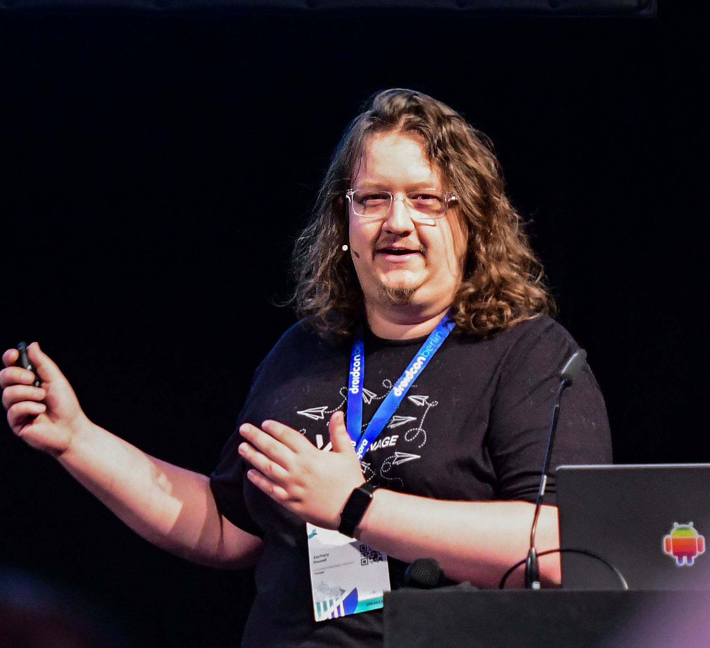 

---

# Takeaways

 

---

## Takeaways

# Not another Kotlin Multiplatform code talk.  

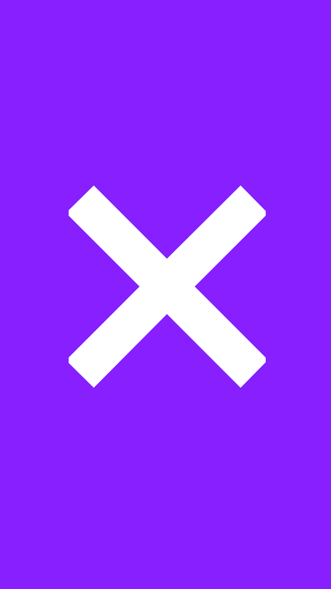 

---

## Takeaways

# Real world example of a team building a library in Kotlin Multiplatform

 

---

## Takeaways

# Learn from the pain

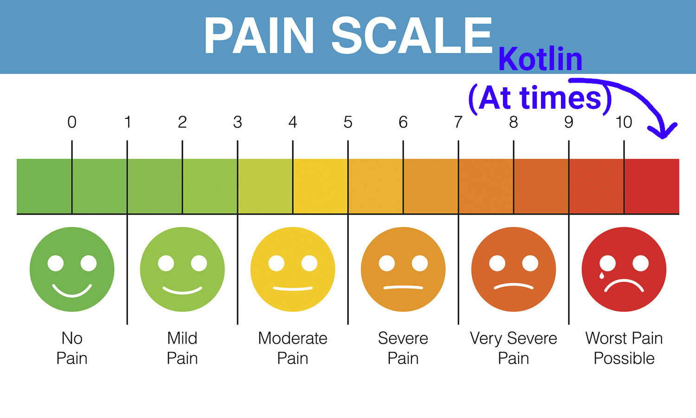 

* History of the SDK's
* Past attempts at codeshare

---

## Takeaways

# See the success!

 

* Main changes from old codeshare
* The SDKs now
* Suprising improvements

---

# What are the Vonage Client SDKs?

 

---

## What are the Vonage Client SDKs?

# Android, iOS and JS SDKs

 

---

## What are the Vonage Client SDKs?

# Wrappers for the Vonage REST/WebRTC APIs

 

---

## What are the Vonage Client SDKs?

# Make it easier to use the Vonage APIs in a native friendly way
# Developers are our world.

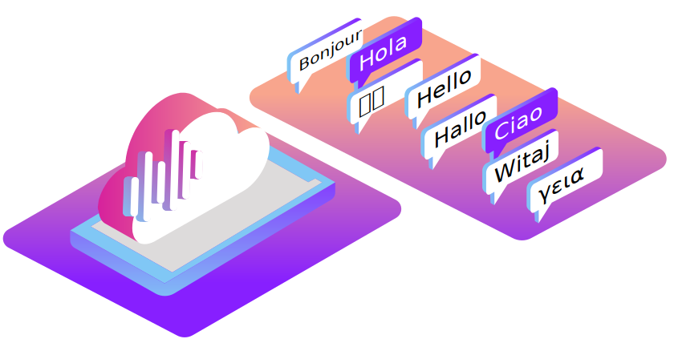 

---

## History Lesson 

# A long time ago in a tech company far, far away.... 

 

---

* Three native SDK's, Android, iOS, JS all separate
* Tough to test across all platforms
* New features written by three separate teams
* 3x the work to implement something new

---

# Nexmo was bought by Vonage.

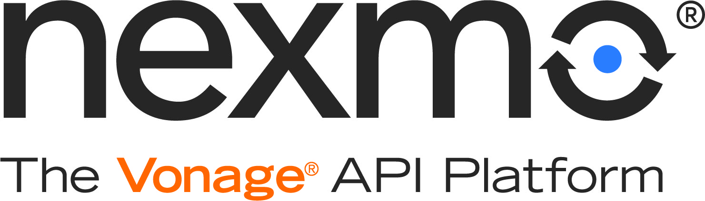

---

# Rewrite!

---

## Kotlin Multiplatform try 1

* JS team took a look at Kotlin Multiplatform at a VERY early stage
* They wanted to rebuild EVERYTHING in Kotlin Multiplatform
* This failed.
* But we still want shared code!

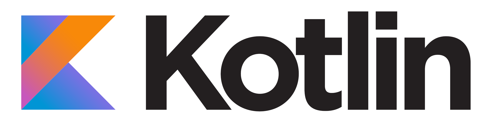

---

## Enter C++

* Allowed for some codeshare
* Base level with platform specific code written on top.

---

# Happy Codeshare! Right?!

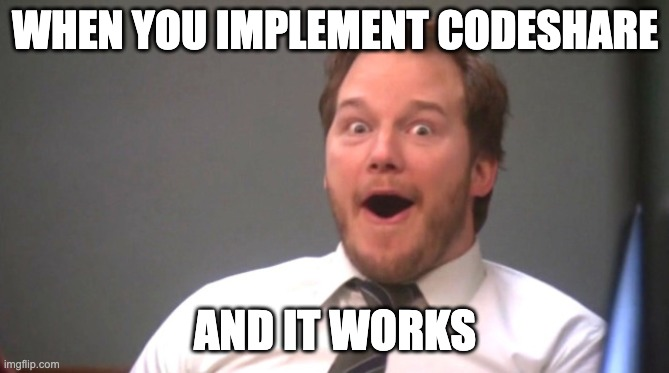

---

# <!--fit--> No.

---

## Or Not.

* Still had three separate code bases on top of the C++ layer
* C++ code wasn't accessible to all on the team. 
* Very slow builds limiting release cadence

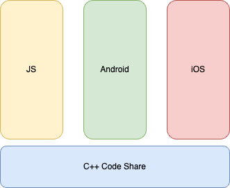

---

# Rewrite!

---

## But with what?

* Shared code, just better
* Share business logic, not low-level platform stuff

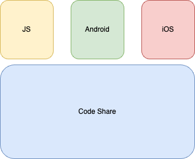

---

## What options?

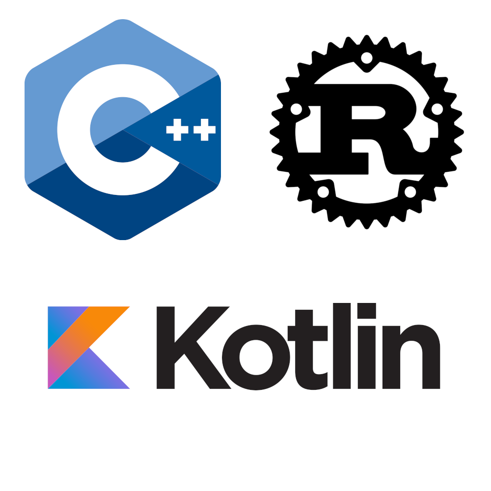

---

# <!--fit-->  No. Please. No.

---

## Rust

* Very powerful
* Good shared codebase option
* Doesn't solve binding issues. 
* Tooling for native was relatively unknown.

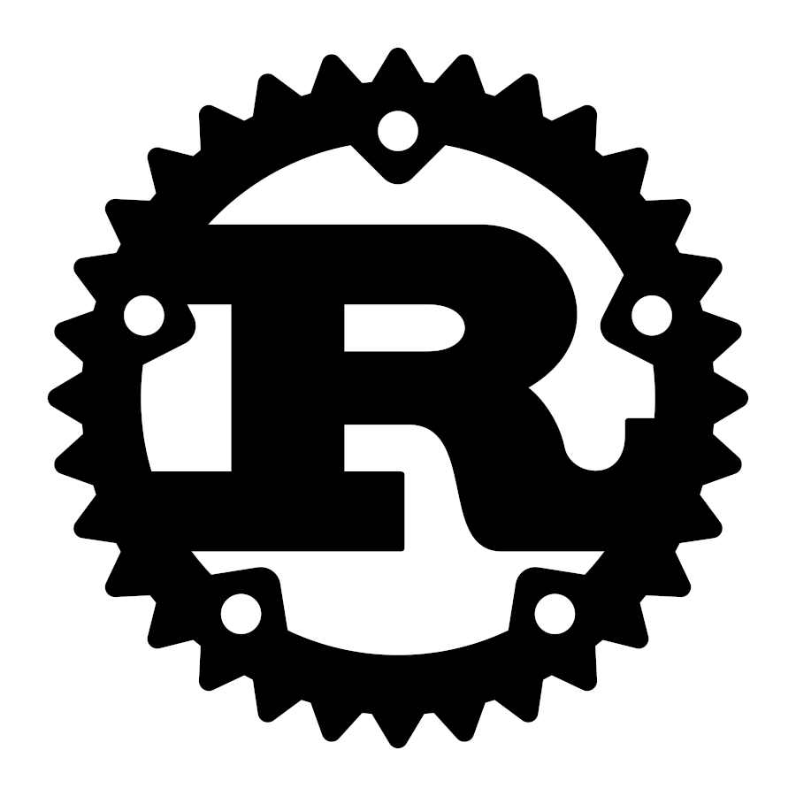

---

## Kotlin Multiplatform

* Also a very good option for shared codebase
* Bindings solved! 
* Let's Prototype

---

## Prototype

* December 2021, Perfect time to hide and build the prototype.
* Very careful about what to put into the shared code
* Kotlin Multiplatform for business logic. Platform specific code stays out!

---

## Platform Specific

* Networking - HTTP client, WebSocket, WebRTC client.
* Platform specific exposed behind interfaces for Kotlin Multiplatform to access.

---

## Prototype delivered!

# And it worked!

---

#  <!--fit--> Then drama!

---

# Ashley dared to have a baby (congratulations)

---

# Team members left

---

# Team had to focus on bug fixing in the current SDK

---

# <!--fit-->  But wait!

---

# The team is reminded of the pain points

---

# Ashley returns! 

---

# <!--fit-->  “Sod it let's do it” - Ashley

---

## From Prototype to SDK

# What needed to happen?

---

# Focus had just been on iOS and Android, JS was needed as well!

---

## I asked the team
# What were the main changes?

---

# Team had to learn Kotlin 
mix of Android, iOS and JS devs

---

# All in on Gradle

This made iOS devs sad.

---

# Shift in tooling, moving to a new IDE 

A lot of the team had been using their own preferred IDE/text editors for the shared C++ code.

---

## Today!

# Vonage Client SDK for Voice released!

Vonage Client SDK for Chat releasing end of Q1

---

## Lessons Learnt / Reflection

# What changed?

---

# Keep up to date with Kotlin updates

Language still getting large updates

---

# Original pain point of consistency has been removed!

Write once for everywhere!

---

# Platform code is just exposing the functionality 

More time to work on improving the API contract and making the SDK a joy to use!

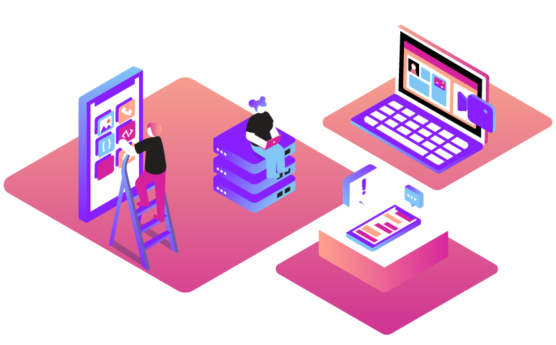

---

# Everyone knows Kotlin, anyone can build a feature 

unlike before with C++/SDK

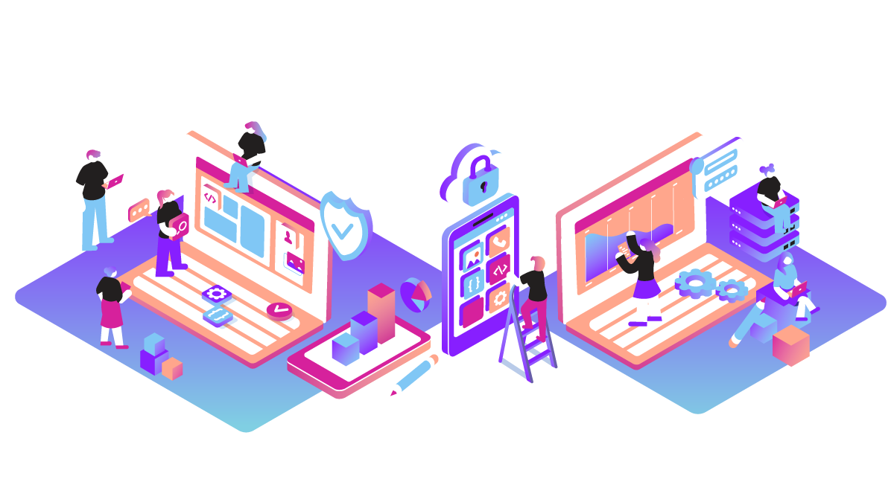

---

# Move to a Mono repo

Whole team synced across all platforms

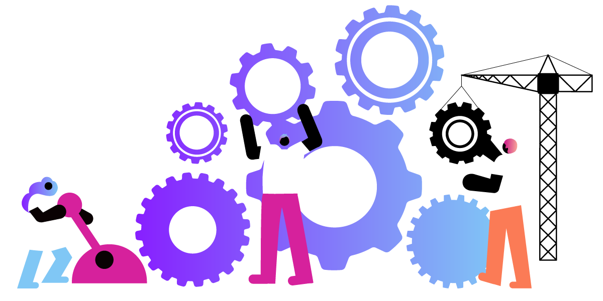

---

# We have tests! 

Tests are the key to saving developers (which are our world!)

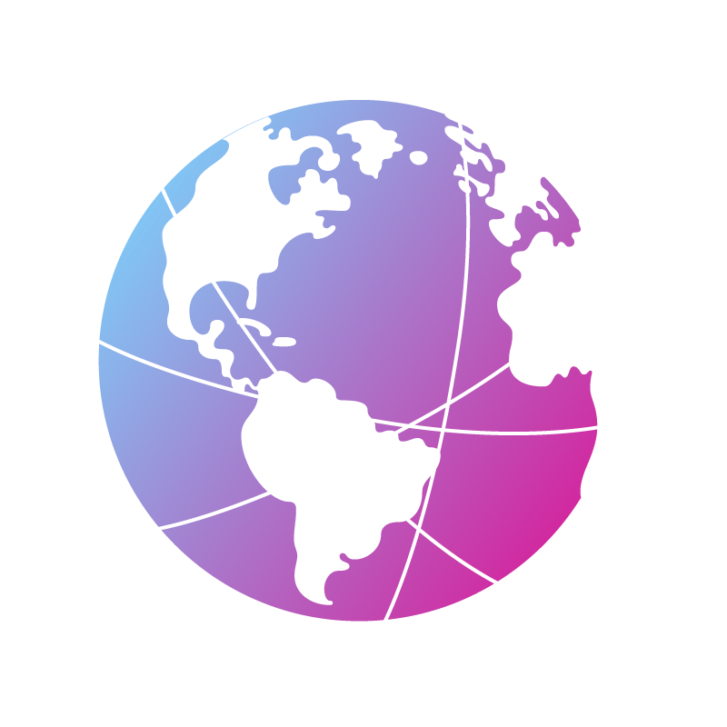

---

# Go check out the SDKs

Coupon Code, €10 free credit: <b>XXXXXXX</b>

developer.vonage.com

github.com/Vonage-Community/tutorials-client_sdk-ios-android-js

---

# Thank you!

 

polywork.com/devwithzachary

github.com/devwithzachary/presentations