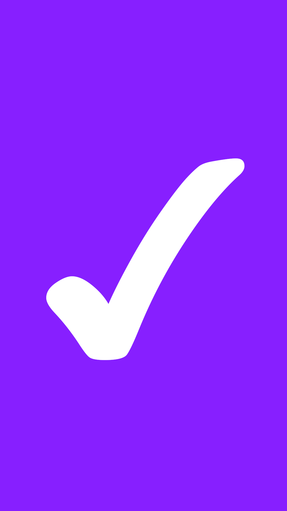
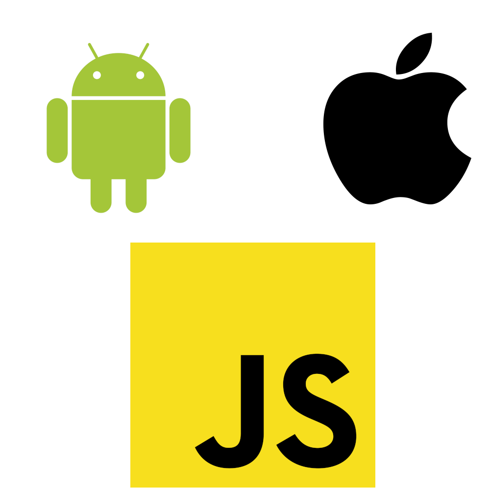
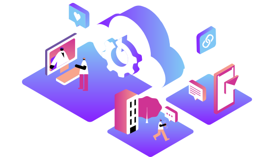

# How Vonage Moved its Client SDKs to Kotlin Multiplatform 
## and saved the world 
## (kind of)

---

## Intros
# Ashley Arthur
## Software Dev Engineer 
The brains behind the talk

---

## Intros
# Zachary Powell
## ~~Sr Android Developer Advocate~~ Manager, DevRel
The one that gets to stand up here and talk to you.

 

---

# Takeaways

 

---

## Takeaways

# Not another KMP code talk.  

 

---

## Takeaways

# A real world example of a team building a library in KMP

 

---

## Takeaways

# Learn from the pain

 

* History of the SDK's
* Past attempts at codeshare

---

## Takeaways

# See the success!

 

* Improvements KMP made
* The SDKs now
* Suprising improvements

---

# What are the Vonage Client SDKs?

 

---

## What are the Vonage Client SDKs?

# Android, iOS and JS SDKs

 

---

## What are the Vonage Client SDKs?

# Wrappers for the Vonage REST/WebRTC APIs

 

---

## What are the Vonage Client SDKs?

# Make it easier to use the Vonage APIs in a native friendly way

 

---

## History Lesson 

# A long time ago in a tech company far, far away.... 

 

---

* Three native SDK's, Android, iOS, JS all separate
* Tough to test across all platforms
* New features written by three separate teams
* 3x the work to implement something new

---

# Nexmo was bought by Vonage.

---

# Rewrite!

---

## Kotlin Multiplatform try 1

* JS team took a look at KMP at a VERY early stage
* They wanted to rebuild EVERYTHING in KMP
* This failed.
* But we still want shared code!

---

## Enter C++

* Allowed for some codeshare
* Base level with platform specific code written on top.

---

# Happy Codeshare! Right?!

---

# <!--fit--> No.

---

## Or Not.

* Still had three separate code bases on top of the C++ layer
* C++ code wasn't accessible to all on the team. 
* Very slow builds limiting release cadence

---

# Rewrite!

---

## But with what?

* Shared code, just better
* Share business logic, not low-level platform stuff

---

## What options?
* C++
* Rust
* Kotlin Multiplatform

---

# <!--fit-->  No. Please. No.

---

## Rust

* Very powerful
* Good shared codebase option
* Doesn't solve binding issues. 
* Tooling for native was relatively unknown.

---

## Kotlin Multiplatform

* Also a very good option for shared codebase
* Bindings solved! 
* Let's Prototype

---

## Prototype

* December 2021, Perfect time to hide and build the prototype.
* Very careful about what to put into the shared code
* KMP for business logic. Platform specific code stays out!

---

## Platform Specific

* Networking - HTTP client, WebSocket, WebRTC client.
* Platform specific exposed behind interfaces for KMP to access.

---

## Prototype delivered!

# And it worked!

---

## Then drama!

* Ashley dared to have a baby (congratulations)
* Team members moved on
* Team had to focus on bug fixing in the current SDK

---

## But wait!

* The team is reminded of the pain points
* Ashley returns! 
* “Sod it let's do it” - Ashley

---

## From Prototype to SDK

# What needed to happen?

---

## From Prototype to SDK
# Focus had just been on iOS and Android, JS was needed as well!

---

## From Prototype to SDK

# Main changes had nothing to do with writing Kotlin Multiplatform code

---

## From Prototype to SDK

# Team had to learn Kotlin 
mix of Android, iOS and JS devs

---

## From Prototype to SDK

# All in on Gradle

This made iOS devs sad.

---

## From Prototype to SDK

# Shift in tooling, moving to a new IDE 

A lot of the team had been using their own preferred IDE/text editors for the shared C++ code.

---

## Today!

# Vonage Client SDK for Voice public

With others coming soon(tm)

---

# Lessons Learnt / Reflection

---

## Lessons Learnt / Reflection

# Keep up to date with Kotlin updates

still getting pretty large updates, but they are kept behind feature flags

---

## Lessons Learnt / Reflection

# Original pain point of consistency has been removed!

---

## Lessons Learnt / Reflection

# Platform code is just exposing the functionality 

More time to work on improving the API contract and making the SDK a joy to use!

---

## Lessons Learnt / Reflection

# Everyone knows Kotlin, anyone can build a feature 

unlike before with C++/SDK

---

## Lessons Learnt / Reflection

# Move to a Mono repo

---

## Lessons Learnt / Reflection

# We have tests! 

(Tests are the key to saving the world.)

---

## Thank you!

# Go check out the SDKs

---

## Thank you!

# See you at Droidcon!

---

# Thank you!

 

polywork.com/devwithzachary

github.com/devwithzachary/presentations