# LinuxOnAndroid
Reviving a 10 year old Android project

---

# Who am I?

* Sr Android Developer Advocate at Vonage
* Android Developer for 12+ years
* An Android enthusiast for many many years
* Lead of the LinuxOnAndroid project
* Four Leasons learnt by fire

 

---

# It all started with...

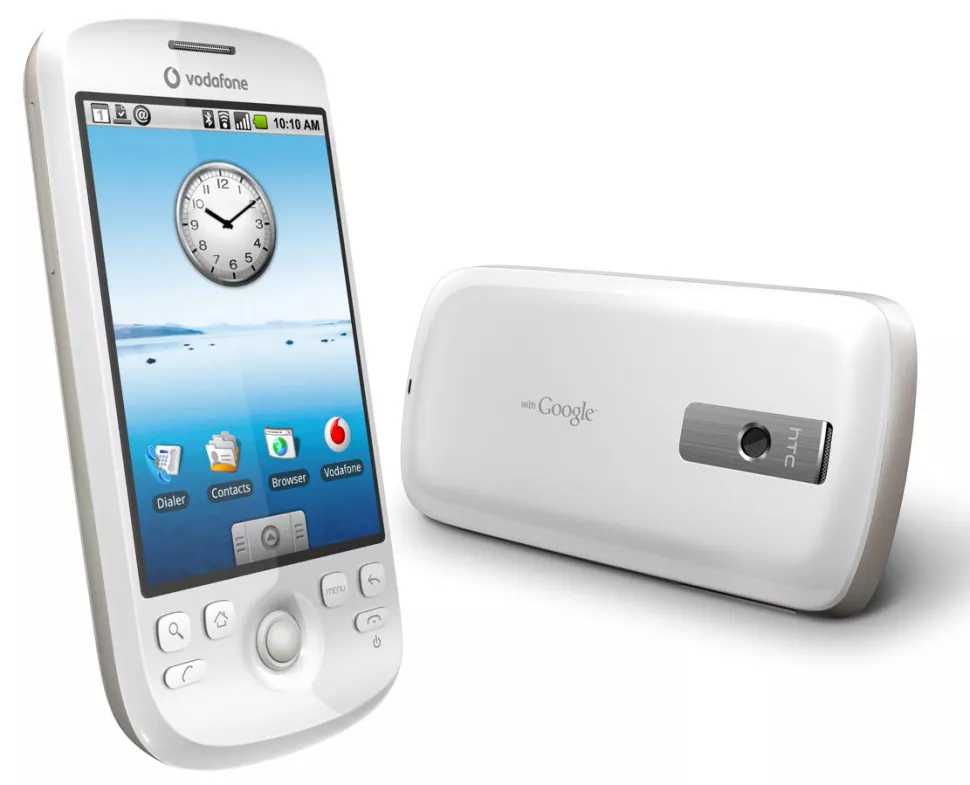

---

# What is LinuxOnAndroid

* Run full (GNU) Linux distros on your Android device
* Via Chroot (Think Linux for Chromebook)
* Run GUI via VNC
* Doesn't touch Android
* Required Root

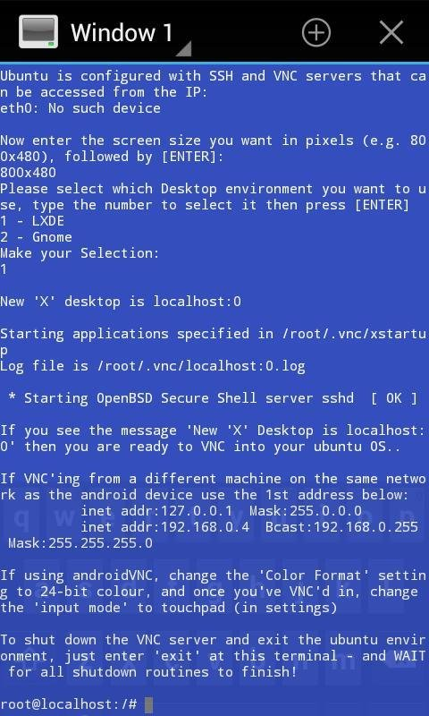

---

# How did the project start?

* Born out of hacking
* XDA guides
* Simple command line scripts run over ADB

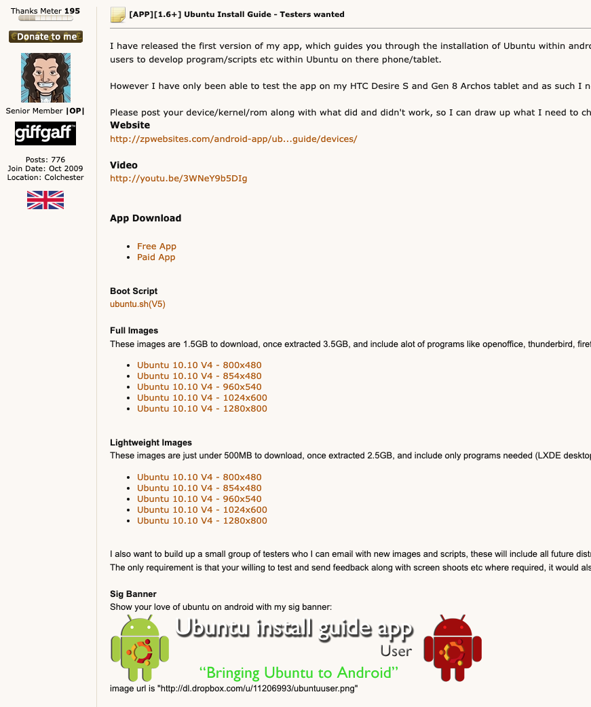

---

# Progressed into a full app

Integrated downloading, extracting and running Linux images

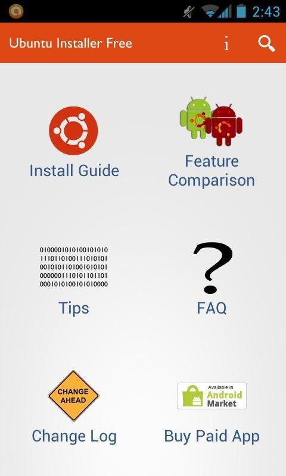

---

# App revisions and improvements

* Continued to update and improve the app.
* No more dashboard!
* High-tech slideout menu

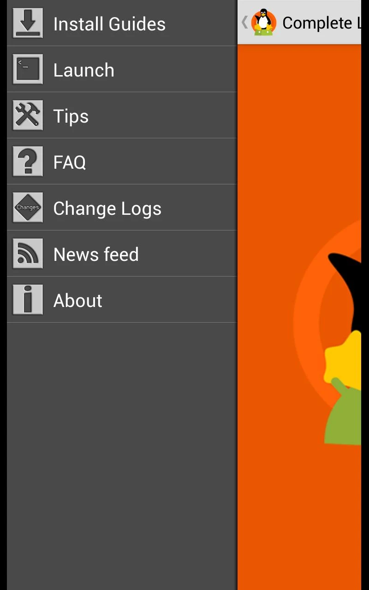

---

# Successful Kickstarter

* 2013 everyone was doing it!
* Allowed for more focus

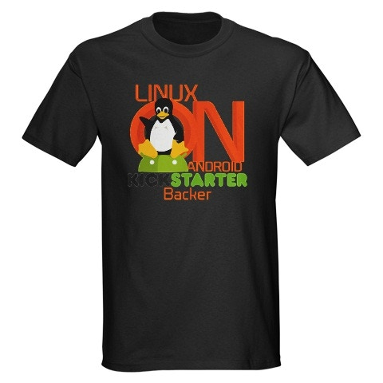

---

# More Improvements

* Removed paid version
* Ads + IAP
* Open source (on Source Forge)

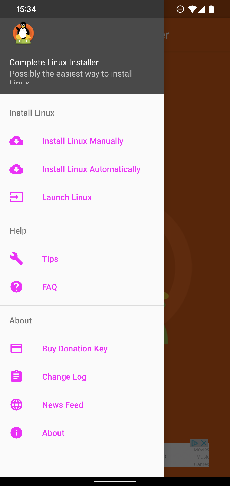

---

# Wide Success

* 1+ million downloads
* 100,000 + Active installs
* Featured in Linux Format

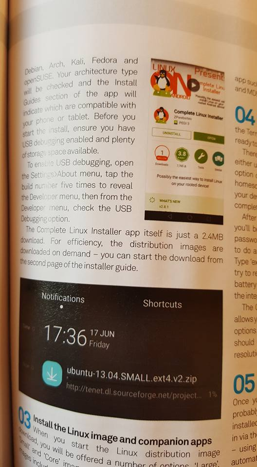

---

# And then.... Life

* \+ Offered a job
* \+  Worked on building a tablet with Linux on Android built in
* \+ Freelanced as Android developer
* \+ Got married
* = No time for Linux on Android

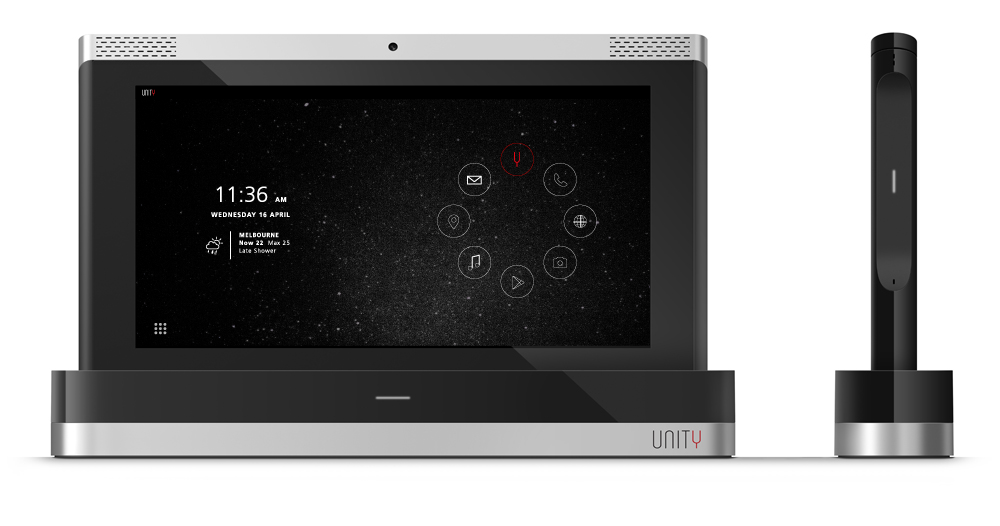

---

# Time to start again

* 2021, people still using the project
* Still over 10,000 active installs
* Time to get back to work
* New "Proot" meant no longer needed root

---

# Dust off the code

* Mirror on Github still up
* Android has come a very long way!
* Keystore Where Art Thou?
* Do we rebuild or start again?

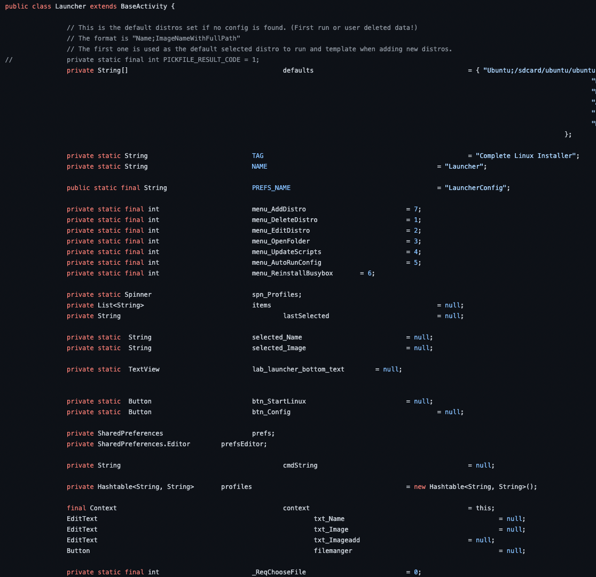
 

---

# Website, Hosting

* Old site using random host provider
* WordPress
* Slow and expensive

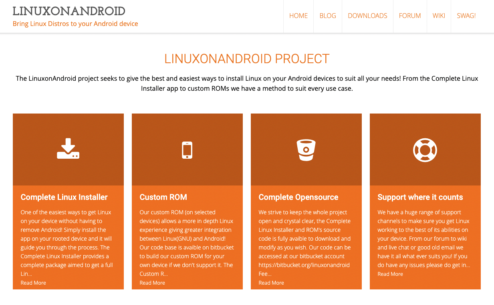

---

# Source code, Files

* Hosted on Source Forge

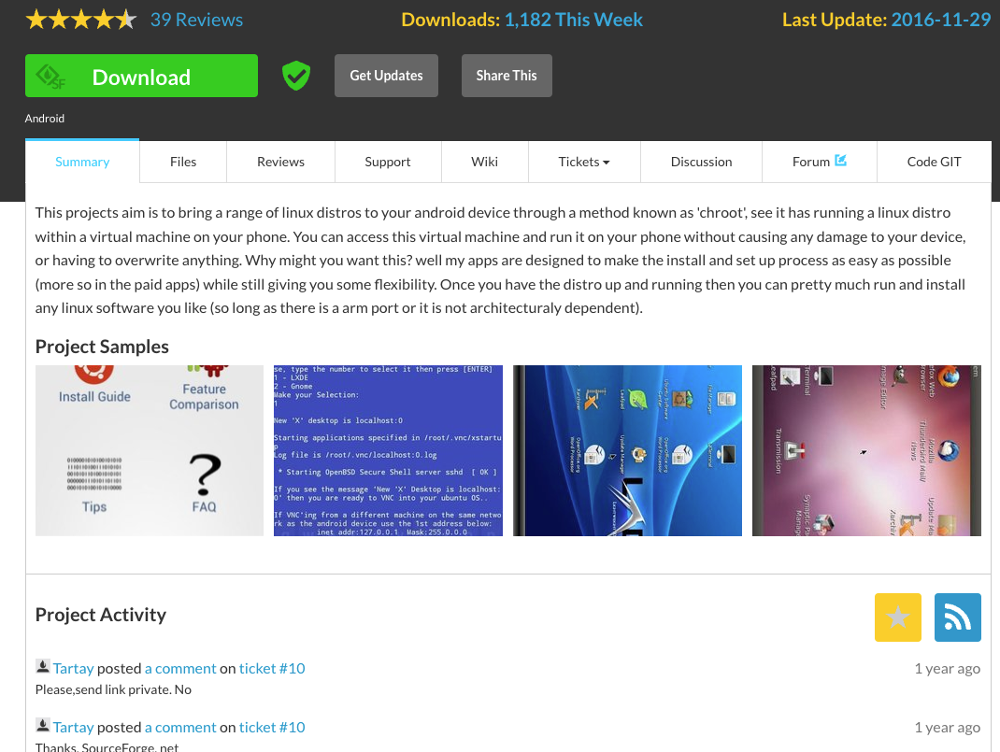

---

# Communication

* All old communication was done via a Freenode IRC channel

---

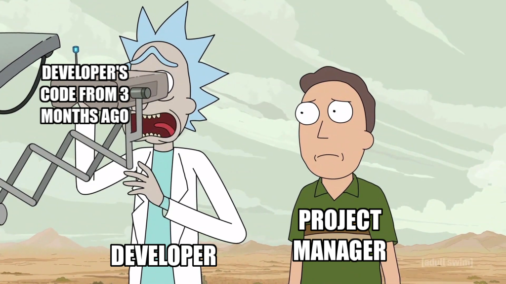

u/patoezequiel

---

# Lessons learned

---

# 1 - Architecture

* Vital to develop Apps Architecture early on
* Enforce it!
* Maintain docs, and make it easy for other devs.

---

# 2 - Third Parties

* No platform stays at the top forever
* Always have a backup plan
* Minimise your dependencies

---

# 3 - Android moves quick

* A lot has changed in 10 years
* But you don't need every bell and whistle!
* Features, Styles, and best practices change

---

# 4 - Communication

* Keep communication open
* Make it easy for others to help
* Even communication channels have to change.

---

# Thank you!

 

https://www.polywork.com/devwithzachary

https://github.com/devwithzachary/presentations