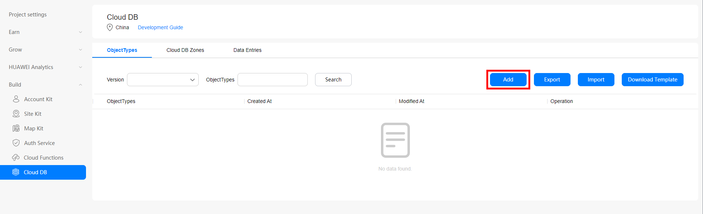

# <!--fit-->  < ?

<!-- What is serverless?
- Joke about no server emoji
 -->


---

# What is Serverless?

    

- Cloud Computing++
- Direct access to a service
- No server maintenance/overhead
- AWS Lambda, Google Cloud Functions, Firebase, Microsoft Azure Functions

<!--
- Serverless is the next step on from cloud computing

- Services are provided directly by company via some form of API or CLI/GUI interface

- All hardware and software is managed for you, no need to worry about typical devops tasks
-->

---

# Useful for Mobile Development, but why?

---
# Useful for Mobile Development, but why?


- Low overhead
- Free tiers
- Secure
- Automatic Scaling
- Focus on App Development
- Prototyping


<!--

Normal advantages for anyone using serverless, low overhead, free teirs, secure, scaling

This lets developer focus on app development.

Really great for larger companies to when they want to prototype something new.

-->

---

# Huawei's Offerings, geared towards mobile development

- **Cloud DB** - Object Database with seamless synchronization between local device and CloudDB
- **Cloud Storage** - Scalable file static storage
- **Cloud Hosting** - Host webapps and static web pages.
- **Cloud Functions** - Serverless computing power for your applications

<!--
Huawei offers a wide range of services geared towards mobile development.

Highlights from top four
-->

---

# CloudDB

Supported Platforms:

- Android - ```implementation 'com.huawei.agconnect:agconnect-cloud-database'```
- iOS - CocoaPods - ```pod 'AGConnectDatabase'```
- Web - ```npm install --save @agconnect/database```

Server SDKS:

- Java - ```implementation 'com.huawei.agconnect.server:agconnect-database-server-sdk'```
- Javascript - ```npm install --save @agconnect/database-server```

<!--
on-demand autoscaling

Bolsters your apps with real-time, device-cloud data synchronization, multi-device data synergy, and offline data availability.


-->

---

## Setup

```java
public static void initAGConnectCloudDB(Context context) {
    AGConnectCloudDB.initialize(context);
}
```

```java
mCloudDB = AGConnectCloudDB.getInstance();
mCloudDB.createObjectType(ObjectTypeInfoHelper.getObjectTypeInfo());
```

<!--
Examples in Java but just as easy in other platforms Languages

Initialise CloudDB at app startUp

Get an instance and create your objects via provided object helpers
-->

---

## Web portal



<!--
Simple web portal with GUI to setup your Objects

From here also setup your cloud DB zones, different physical locations to store data separately (china, germany, russia)

Also view and query data from here
-->

---

## Web portal

```json
{
   "objectTypes":[
      {
         "indexes":[
         ],
         "objectTypeName":"BookInfo",
         "fields":[
            {
               "isNeedEncrypt":false,
               "fieldName":"id",
               "notNull":true,
               "belongPrimaryKey":true,
               "fieldType":"Integer"
            },
         ]
      }
   ]
}
```

<!--
Or import your config via JSON
 -->

---
## Export

```java
@PrimaryKeys({"id"})
@Indexes({"bookName:bookName"})
public final class BookInfo extends CloudDBZoneObject {
    private Integer id;
    private String bookName;
    private String author;
    private Double price;
    private String publisher;
    private Date publishTime;
    @DefaultValue(booleanValue = true)
    private Boolean shadowFlag;
    public BookInfo() {
        super(BookInfo.class);
        this.shadowFlag = true;
    }
```

<!--
Export your objects and java classes are generated for you and provided for download
 -->

---

## Write

```java
public void upsertBookInfos(BookInfo bookInfo) {
    Task<Integer> upsertTask = mCloudDBZone.executeUpsert(bookInfo);
    upsertTask.addOnSuccessListener(new OnSuccessListener<Integer>() {
        @Override
        public void onSuccess(Integer cloudDBZoneResult) {
            Log.i(TAG, "Upsert " + cloudDBZoneResult + " records");
        }
    }).addOnFailureListener(new OnFailureListener() {
        @Override
        public void onFailure(Exception e) {
            mUiCallBack.updateUiOnError("Insert book info failed");
        }
    });
}
```

<!--
Example of upserting (insert or update) a BookInfo object instance

Returns number of successful inserts

executeUpsert can also take a list of Objects
 -->

---

## Query

```java
    public void queryAllBooks() {
        Task<CloudDBZoneSnapshot<BookInfo>> queryTask = mCloudDBZone.executeQuery(
                CloudDBZoneQuery.where(BookInfo.class),
                CloudDBZoneQuery.CloudDBZoneQueryPolicy.POLICY_QUERY_FROM_CLOUD_ONLY);

        queryTask.addOnSuccessListener(new OnSuccessListener<CloudDBZoneSnapshot<BookInfo>>() {
            @Override
            public void onSuccess(CloudDBZoneSnapshot<BookInfo> snapshot) {
                processQueryResult(snapshot);
            }
        }).addOnFailureListener(new OnFailureListener() {
            @Override
            public void onFailure(Exception e) {
                mUiCallBack.updateUiOnError("Query book list from cloud failed");
            }
        });
    }

    private void processQueryResult(CloudDBZoneSnapshot<BookInfo> snapshot) {
        CloudDBZoneObjectList<BookInfo> bookInfoCursor = snapshot.getSnapshotObjects();
        List<BookInfo> bookInfoList = new ArrayList<>();
        try {
            while (bookInfoCursor.hasNext()) {
                BookInfo bookInfo = bookInfoCursor.next();
                bookInfoList.add(bookInfo);
            }
        } catch (AGConnectCloudDBException e) {
            Log.w(TAG, "processQueryResult: " + e.getMessage());
        } finally {
            snapshot.release();
        }
        //DO something with the list
    }
```
<!--
How we might query and process results from the database

Create query task, supports expected where logic, in this instance just getting all.

Policy to query either the cloud, local copy or either

Get back a Data snapshot

Process this in processQueryResult by iterating over snapshot and do some processing with that BookInfo object
 -->
---

# Cloud Storage

Supported Platforms:

- Android - ```implementation 'com.huawei.agconnect:agconnect-storage'```
- iOS - CocoaPods - ```pod 'AGConnectStorage'```
- Web - ```npm install --save @agconnect/cloudstorage```

Server SDKS:

- Java - ```implementation 'com.huawei.agconnect.server:agconnect-storage-server-sdk'```
- Javascript - ```npm install --save @agconnect/cloudstorage-server```


<!--
Works with Auth Service, and utilizes a declarative security model to allow only authenticated accesses.

Keeps download and upload speeds stable with edge nodes, resumable transfers, and network acceleration.
-->

---

## Setup

```Java
AGCStorageManagement storageManagement = AGCStorageManagement.getInstance();
AGConnectOptions cnOptions = new AGConnectOptionsBuilder().setRoutePolicy(AGCRoutePolicy.CHINA).build(this);
AGConnectInstance cnInstance = AGConnectInstance.buildInstance(cnOptions);
AGCStorageManagement storageManagement= AGCStorageManagement.getInstance(cnInstance, "bucket name");
```

```Java
StorageReference reference = storageManagement.getStorageReference();
//or
StorageReference reference = storageManagement.getStorageReference("images/demo.jpg");
//or
StorageReference reference = storageManagement.getReferenceFromUrl(AGConnectInstance.getInstance(), "https://xxxxxx");
```

<!--
Get a storage instance, configure your preferred routing.

Get bucket

Three ways to get storage references.

Get the whole bucket

Get a specific file/path

Or get reference from a url of a file
-->

---

## Upload

```Java
UploadTask task = reference.putFile(new File("path/images/test.jpg"));
task.addOnFailureListener(new OnFailureListener(){
    @Override
    public void onFailure(@NonNull Exception exception) {
    }
}).addOnSuccessListener(new OnSuccessListener<UploadTask.UploadResult>(){
    @Override
    public void onSuccess(UploadTask.UploadResult uploadResult) {
    }
});
```

<!--
Upload a file to the reference you have got, use a specific file to upload to that file or overwrite it.

"path/images/test.jpg" - local file path accepts file objects
-->

---

## Listing Files

```java
Task<ListResult> listTask = storageManagement.getStorageReference("images/").listAll();
ListResult listResult = Tasks.await(listTask);
StorageReference reference = listResult.getFileList().get(0);
Task<FileMetadata> metaTask = reference.getFileMetadata();
```

## Delete Files
```Java
reference.delete();
```

<!--
If getting a reference of a folder you can list files in that folder. Then get the metadata about the specific Files

Deleting is super easy, so long as you have the permission to do it ;)
-->

---

## Download File

```Java
StorageReference reference = storageManagement.getStorageReference("images/demo.jpg");
File file = new File("path/images/test.jpg");
DownloadTask task = reference.getFile(file);
task.addOnFailureListener(new OnFailureListener(){
    @Override
    public void onFailure(@NonNull Exception exception) {
    }
}).addOnSuccessListener(new OnSuccessListener<DownloadTask.DownloadResult>(){
    @Override
    public void onSuccess(DownloadTask.DownloadResult downloadResult) {
    }
});
```

<!--
get reference to file, create file object, download file via task
-->

---

# Cloud Hosting

Host static generated web apps and websites.
Version controlled by default.
One-Click Deployment
Access Accerlation via CDN
Secure config free certificate

<!--
Simple cloud hosting for static web apps and websites.

Use version controlling to easily roll back to older site versions

Deploy across sites easily and uses CDN for local accerlation.

Include ssl security and configuration for free
-->
---

# Cloud Functions

Supported Platforms:

- Android - ```implementation 'com.huawei.agconnect:agconnect-function'```
- iOS - CocoaPods - ```pod 'AGConnectFunction'```
- Web - ```npm install --save @agconnect/function```

Cross Platform:

- Flutter - ```apply plugin: 'com.huawei.agconnect'```
- React Native - ```npm install @react-native-agconnect/cloudfunctions```
- Cordova - ```cordova plugin add @cordova-plugin-agconnect/cloudfunctions```

<!--

Auto scalling, direct interaction with other services.

Event triggers to fire code

-->
---

# Create Functions

- Node.js run time
- Simple Web based IDE
- Configurable Environment Variables

<!--
Code using Node.js run time and Javascript

Web Base IDE included, or upload code as package

Config environment variables as required

-->

---

# Triggers

- **HTTP**  HTTP request is made
- **CLOUDDB**  Database data change event occurs
- **AUTH**  User registers, signs in or out
- **CLOUDSTORAGE** File uploaded or deleted
- **CRON** Run at specified time

---

# Create Functions

```Javascript
module.exports.myHandler = function(event, context, callback, logger) {
    logger.info(JSON.stringify(event));
    let result = {"message":"success"}
    callback(result);
};
```

<!--

Most basic example of functions

event: JSON-format event object passed by the caller.

context: function running context object. It encapsulates the log API, callback API, and environment variable object env.

callback: event handling result.

logger: logs.

-->

---

# Event Object Examples

HTTP trigger

```JSON
{
    "path": "yourpath",
    "httpMethod": "POST",
    "headers": {"Content-Type": "application/json"},
    "queryStringParameters": "key1=value1&key2=value2",
    "body": {"request": "Hello World!"},
    "isBase64Encoded": true
}
```

<!--
Path for generating a trigger URL.

Trigger request mode. Currently, HTTP triggers support only the POST method.

Request header, which specifies the request or description message

Query parameter in key-value pairs. Multiple pairs are allowed.

Request body, which can be customized. The request body is in JSON format and cannot exceed 4 MB.

Indicates whether the message body is a Boolean value encoded using Base64.
-->

---

# Event Object Examples

CLOUDDB data deleted

```json
{
    "records": [
        {
            "id": 0
        },
    ],
    "objectTypeName": "EntityOne",
    "naturalStoreName": "AdminSdkZoneTest",
    "eventType": "onDelete"
}
```

<!--
Primary key information about the deleted data.

Table name.

Storage zone name.


Operation type.
-->

---

# Example

```Javascript
let myHandler = function(event, context, callback, logger) {
    var res = new context.HTTPResponse(context.env, {
        "res-type": "context.env",
        "faas-content-type": "json",
    }, "application/json", "200");

    var year;
    if (event.body) {
        var _body = JSON.parse(event.body);
        year = _body.year;
    } else {
      year = event.year;  
    }
    var body = {
        result:''
    };
    body.result = leapYear(year);
    res.body = body;
    callback(res);
    function leapYear(year) {
        var resultString;
        if(!isNumber(year)){
            resultString = "input is not a number";
        }else{
            var isLeapYear = ((year % 4 == 0) && (year % 100 != 0)) || (year % 400 == 0);
            resultString = isLeapYear ? "is leap year" : "is non-leap year";
        }
        return resultString;
    }
    function isNumber(input){
        if (parseInt(input).toString() == "NaN") {
            return false;
        } else {
            return true;
        }
    }
};
module.exports.myHandler = myHandler;
```

<!--

Example function where we take a number as a year and check to see if its a leap year.

Returning a string as the result body

-->

---

# Function call from Apps

```Java
AGConnectFunction function  = AGConnectFunction.getInstance();
function.wrap("myhandlerxxxx-$latest").call(); //Without input parameters
```

<!--
Simple method to call a function that requires no input and doesn't care about the output
-->

---

# Function call from Apps

```Java
private void getWeek(String date) {
     HashMap<String, String> map = new HashMap();
     map.put("time", date);
     function.wrap("myhandlerxxxx-$latest").call(map)
             .addOnCompleteListener(new OnCompleteListener<FunctionResult>() {
                 @Override
                 public void onComplete(Task<FunctionResult> task) {
                     if (task.isSuccessful()) {
                         String value = task.getResult().getValue();

                     } else {
                         Exception e = task.getException();
                         if (e instanceof AGCFunctionException) {
                             AGCFunctionException functionException = (AGCFunctionException) e;
                             int errCode = functionException.getCode();
                             String message = functionException.getMessage();
                         }
                         // ...
                     }
                 }
             });
 }
```

<!--
More advanced example, here we pass a hasmap of parameters

Then we used the complete listener to get the result back
-->

---

# But wait there is more!

Remote Configurations, App Messaging, App Linking, A/B Testing, Auth Service, Connect API, Crash, APM, Cloud Testing...

---
# Thank you!

 

https://developer.huawei.com/consumer/en/agconnect

---

# Thank you!

 

https://linktr.ee/devwithzachary
