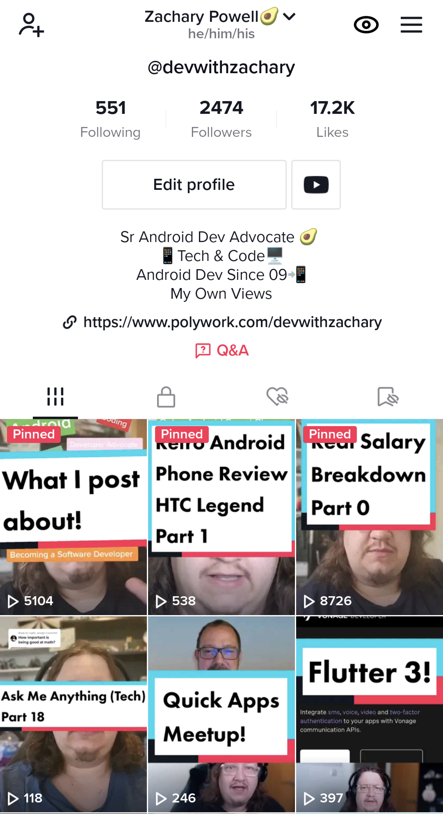
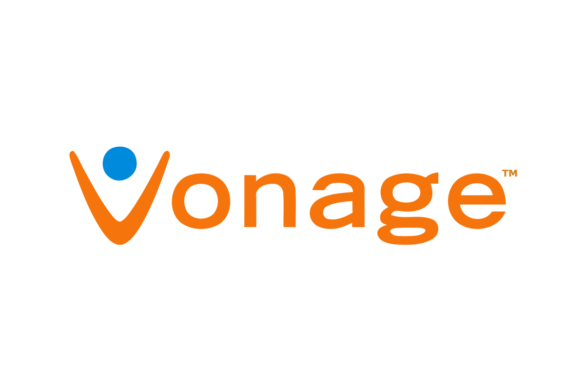
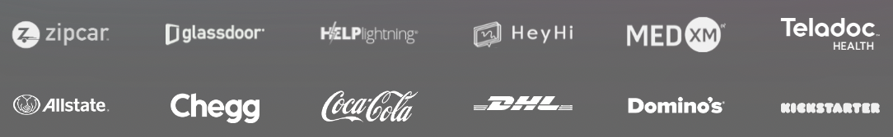
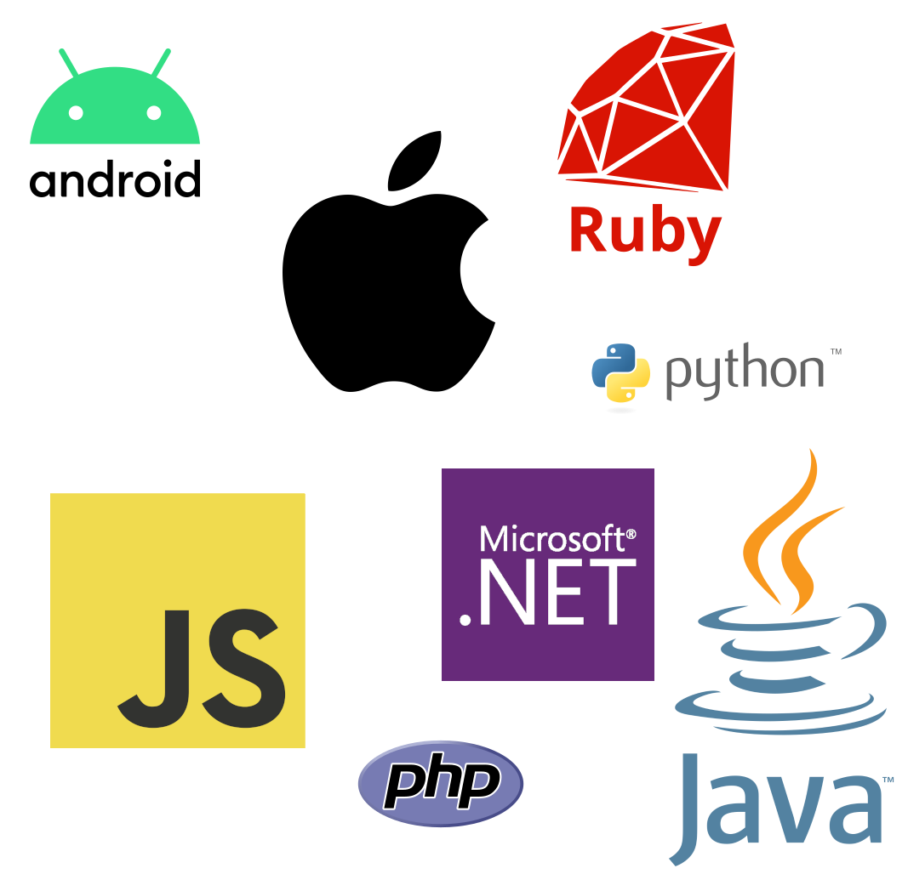
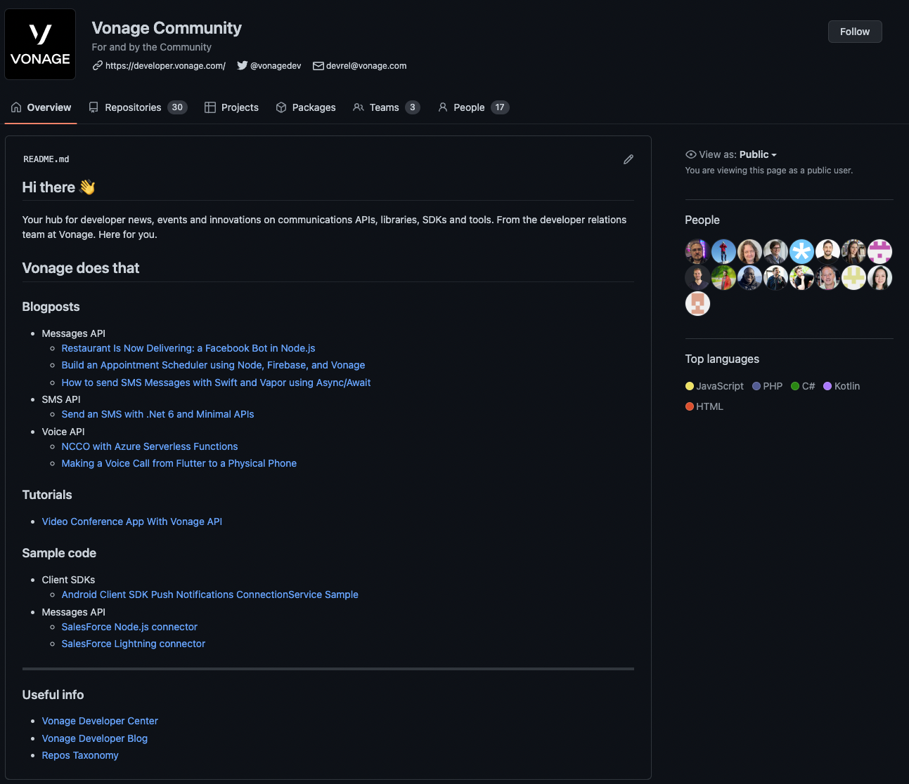
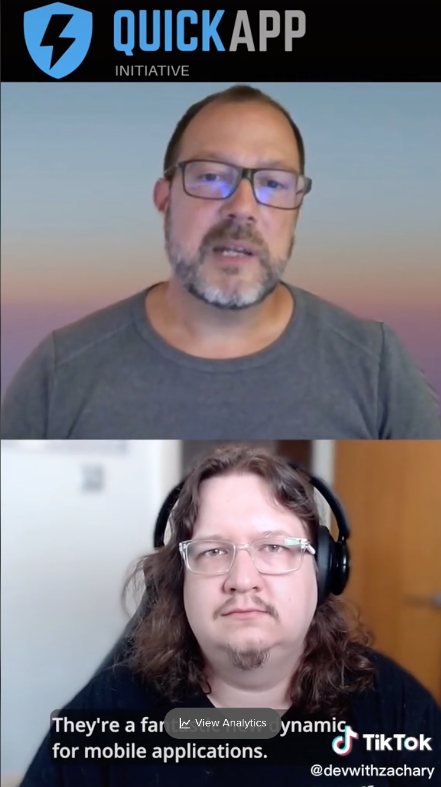

# <!--fit-->  ❤️ 

<!-- 
Welcome everyone, 
I know I'm the last talk so I will try not to ramble on too much, and I'm sure Christian will start waving manically if I start going over time.

I want to just quickly talk a little about who Vonage is and why we are part of the Quick App Initiative. 

Plus a little about what we plan to do this year!

-->
---

# Who am I?

- Sr Android Developer Advocate at Vonage
- Ex Huawei DevRel
- Android Developer for 12+ years
- Moved into DevRel and never looked back!
- Content first approach



<!--

But first a little about myself.

Some of you will know me from my time at Huawei on one of their DevRel teams, pretty sure Christian thought he had gotten rid of me, but I'm back!

Now the Sr Android Developer Advocate at Vonage

Before my time in DevRel, I was an Android Developer, starting in 2009. But at the start of 2021, I started my DevRel journey and I've been loving it ever since!

I tend to take a pretty content-first approach to DevRel so you will often see me on social media, be it Twitter or TikTok!

-->

---

# Who is Vonage?

<!-- 

But who are Vonage, why do we have DevRel and why are we interested in Quick Apps?

-->

---

<div>
<video src="videos/vonage-ad.mp4" controls style="height:500px;float:left;padding-right:10px"></video>
</div>

<!--

Well if you are of a certain age and spent any time in the US you may well have seen one of these annoying catchy ads... which yes I'm going to play now.

-->

---

# Vonage for Home

* Home VOIP phone service



<!--

Vonage was founded in 1998 as a provider of residential telecommunications services based on VOIP technologies and then in 2001 was renamed Vonage.

For several years very focused on the consumer business offering the VOIP phone services. Something it does still offer today.

-->


---

# Vonage Business Communications (VBC)

* Unified communications as a service (UCaaS)
* Voice
* Meetings solutions (audio, video, web)
* Messaging


<!--

However, in more recent years Vonage has moved into the B2B market, offering a new range of tools and products under the Vonage Business Communications or VBC brand. 

These products, via a range of acquisitions, have expanded from just VOIP services into Video, SMS, messaging and full meeting solutions.

All these products come together to form a Unified Communications as a service offering.

-->


---

# Vonage Communication APIs


* Voice, Video, SMS etc.
* Self service


<!-- 

But we aren't here today to talk about either of these areas of the business. No, what we are here to talk about is the Vonage Communication APIs

So as you can see via the fairly natural transition from VOIP to UCaaS Vonage had gathered a pretty powerful platform of services and technology.

It was therefore decided to create a third branch to the business, the Vonage Communication APIs.

These APIs expose much of the Vonage technologies and products as consumable APIs

Fully self-service, any developer can head over to developer.vonage.com, sign up, get some free credit and start using these APIs.

The APIs on offer include:

Voice, both app to app and app to phone/ phone to app 

SMS messaging

Multi-channel messaging including WhatsApp and Facebook

Video

And the Verify API allows two-factor authentication.
-->

---



<!--

This section of the business has grown massively in the past few years with lots of large companies starting to use these APIs within their applications

These are just a few of the well-known companies.

We also offer a very popular start-up program which allows new businesses to get started with the APIs and grow with us.

-->

---

# SDKs



<!--

Importantly we also support a range of platforms.

We have support for server platforms like PHP, Java, Python

And also support client platforms including Android, iOS and JavaScript

These SDKs provide a great way to consume the Vonage APIs in a way that makes sense for your platform or language. 

Each SDK is maintained by members of the DevRel Tooling team all of whom are experts in their particular language. 

These are not just automatically generated SDKs. These are good honest organic and home-baked, just like grandma used to make.

-->

---

# Send a SMS

```js
const from = VONAGE_BRAND_NAME
const to = TO_NUMBER
const text = 'A text message sent using the Vonage SMS API'

vonage.message.sendSms(from, to, text, (err, responseData) => {
    if (err) {
        console.log(err);
    } else {
        if(responseData.messages[0]['status'] === "0") {
            console.log("Message sent successfully.");
        } else {
            console.log(`Message failed with error: ${responseData.messages[0]['error-text']}`);
        }
    }
})
```

<!--

So here we have a quick example of how we might send an SMS message via the JavaScript SDK.

Passing in the Vonage from details and then the phone number you wish to send the message to along with the message itself.

-->

---

# Restful APIs

```
curl -X "POST" "https://rest.nexmo.com/sms/json" \
  -d "from=$VONAGE_BRAND_NAME" \
  -d "text=A text message sent using the Vonage SMS API" \
  -d "to=$TO_NUMBER" \
  -d "api_key=$VONAGE_API_KEY" \
  -d "api_secret=$VONAGE_API_SECRET"
```

<!--

But what's great about these APIs is that under the hood they are just REST APIs, so for example here you can just issue a curl command from the command line and send out an SMS.

With the RestAPIs and Video all done via WebRTC if you're using a language, platform or framework we don't currently support you can still ingrate these APIs into your application.

The APIs also offer OpenAPI specs so consuming them is clear, you will always know when to expect back and what you need to send to any of the endpoints.

-->

---

# Why Quick Apps?


<!--

So, why is Vonage involved with the Quick App Initiative, what about Quick Apps excites us?

-->

---

# Free, Open, Instant


<!--

Firstly its the freedom, a completely new way for developers to distribute their applications how they want to. 

Be it via a website or some kind of marketplace or even physically in person with QR codes and direct links.

The open nature of the Initiative is of particular interest, we have worked hard to make the communication APIs we offer as open as possible.

Providing a wealth of sample code and projects freely on Github, as well as the OpenAPI specs and detailed documentation to make it clear what developers can expect.

We have a continued drive to do more in the open-source community and the Initiative provides a great way to do this.

And then it's the Instant availability of Quick Apps. Something you simply can't get from traditional mobile applications.

-->

---

# Unlock new use cases


<!--

What do all these things bring together? Well, it's the ability to unlock new use cases, for mobile applications in general.

But of course specifically for us, it unlocks new ways for people to use communication APIs.

You are in a new city in a foreign country, the hotel you stay in is recommended a museum that's close by and seems interesting.
The hotel gives you a leaflet about the museum but you have a few questions. 
Of course, the museum only has a phone number you can call, but an international phone call is going to cost you a lot. 
So instead you decide not to go and do something else.

But what if on the leaflet there was a QR code, scanning the code loaded a quick app that provided you with more details.
Most importantly however you notice a "Free call" button, you're connected to the hotel's WIFI and you click this button. 
Within seconds a voice call is started over the WIFI network that connects you directly to the museum's phone. 
As far as the museum is concerned you are just phoning their call, they don't have to make any changes to the process.
But now you have a direct, free way to contact the museum and ask those burning questions.

Or perhaps you are parking in a public car park. I'm not sure about in Paris but certainly, in London a lot of parking no longer has a physical pay point.
You have to use an app to pay, so you go through the process of searching for the app in the app store, downloading, signing up, and confirming your identity via 2fa.
Then enter your payment info and finally search for this specific parking location and pay.

That sucks.

Instead what about a simple QR code on the parking sign, you scan and instantly you are presented with the payment screen. 
You enter your vehicle license plate number and pay. 

Much quicker. 

Now, what if this is a location you often use? We can add the registration process to the quick app, and use the Vonage SMS 2FA to confirm who you are. Then whenever you want to park 
why not offer an SMS option, text the park location and your license plate to a number and instant pay. 

-->

---

# Remove friction, improve UX


<!--

Ultimately what these use cases show is that Quick Apps and Vonage APIs can work well together to remove friction for users and help improve UX for developers.

-->

---

# Commitment to QAI


<!--

So, Vonage is part of the Quick APp Initative, but what does that action mean. What are we doing to be a good, commited member of this initative.

-->

---

# Sample Projects



<!--

We are building sample applications that highlight how to use Vonage API's within Quick Apps. 
These examples will be hosted on the Vonage Community GitHub, but we are also working directly with the Initiative to help them produce more example projects to host on their own repositories.

By showcasing how a developer can ingrate RESTFul APIs like the SMS API they can quickly learn how to make use of other APIs for other use cases. 
These examples will be useful to any developer wanting to use any kind of restful API, not just Vonage's

-->

---

# Easy to use code modules

* Easily drop communication API's into your Quick App
* Range of open source JS modules
* Examples for other members to follow

<!--

We also have goals to provide code modules and snippets that will allow a developer to drop Vonage APIs into their Quick App in a seamless way. 

Just like the SDKs we already provide

These modules will be open source and we hope to provide other initiative members with ideas on how they can build their modules and encourage developers to use their services and code.
-->

---

# Documentation

* Support QAI in building its documentation
* Provide Vonage specific documentation developer.vonage.com

<!--

Documentation is such a vital part of any open source project.

And we understand that. We want to help the Initiative build out its documentation, to make sure any developer wanting to dive into quick apps can do so.

Alongside that, we will continue to build Vonage-specific documentation around using Vonage APIs within Quick Apps. Further promoting the Initiative and driving adoption of Quick App technologies
-->

---

# DevRel Experience

* Provide expert DevRel experience to QAI
* Assit in events and content
* Promote via socials



<!--

And finally, we will continue to provide expert DevRel experience to the Initiative.

Assisting in events, just like this meetup and help create new and interesting content that will engage developers.

But what content creation without a platform to promote it? We will also continue to promote Quick App Initiative content on Vonage developer social media accounts.

This is something we started to ramp up specifically for this meetup including a great 1 minute TikTok with Christian explaining a little about the Initiative. 
I STRONGLY recommended checking it out. No, don't worry neither of us dances.

-->

---
# Thank you!

 


https://www.polywork.com/devwithzachary

https://github.com/devwithzachary/presentations

<!--

And thats it! Thank you everyone, if you do have any questions please do come and see me after! More than happy to chat!

These slides can be found on my github, and if your interested in what else im up to feel free to scan the QR code which will take you to my polywork profile!

-->