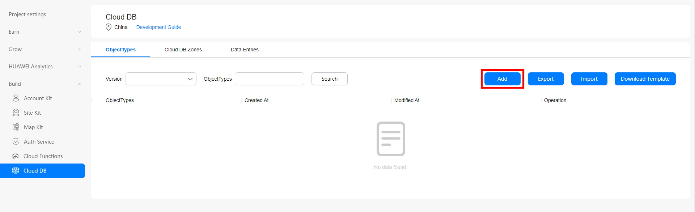

# <!--fit-->  < ?

<!-- 

Hello everyone, I'm Zachary Powell, lead developer advocate for Huawei's AppGallery Connect.

Today we are going to take a deep dive into developing serverless applications, with the help of AppGallery Connect.

Because this is a workshop today while I do have a full slide deck and loads we can look at im more than happy at any time to stop and answer any questions. 

SO please if you do have questions stick your hand up and we will get them answered. 

 -->


---

# What is Serverless?

    

- Cloud Computing++
- Direct access to a service
- No server maintenance/overhead
- AWS Lambda, Google Cloud Functions, Firebase, Microsoft Azure Functions

<!--

But before we get into what Huawei offers, what actually is serverless... What do we mean when we talk about serverless services.

One way to think about it is something like cloud computer plus plus. 

If cloud computing removes the need for a developer to worry about the physical hardware. Then serverless removes the need for a developer to worry about the software.

They are simply being provided direct access to some service via an API or SDK. Direct access to storage, database, processing power. Completely abstracted from the software thats actually supporting that service, the servers operating system etc.

There are lots of offerings on the market, all the big tech comapnies are in this space, AWS lambda, Firebase, Azure.. and more recently Huawei!
-->

---
# Useful for Mobile Development, but why?


- Low overhead
- Free tiers
- Secure
- Automatic Scaling
- Focus on App Development
- Prototyping


<!--

So why would serverless functionality be useful? Particularly why as mobile developers might we want to use these services?

Well alot of the benifits match any type of application, web, mobile or what ever else that requires some kind of internet connected back end.

Serverless can be very useful when your looking to build something very quickly. For example you want to prototype a new idea or project. Using serverless means you dont have to worry about setting up a backend server, even a local test one. 

It means you can just directly use the services straight away, consume the API or use the SDK and your good to go.

Alot of these systems also have some free tier, more often than enough this will be perfect for prototyping, who doesnt love having a backend to their application for free!

So you have built your prototype, it was super successful, people loved it and now you want to actually build the application.

Again serverless can be super useful here! 
Because of the abstraction serverless becomes automaticly scaling, you need more power, more space what ever it might be and the service will handle that! 

If you go viral over night theres no worry that the backend to your system will crash!

Finally above all else it means you dont have to be a sys admin, you dont need to be a security expert, you dont need to learn backend skills at all. 

You can focus on what you enjoy, app development!

-->

---

# When serverless is a bad idea

- Custom hardware requirements
- Specific security/regulatory requirements
- Dependant on a 3rd party

<!--
Of course if we are talking about when serverless IS useful, we should also give a mention to those times when its not useful.

As cloud computing in general, because you are putting abstraction layers between your code and the actually hardware, if you have specific hardware requirement. Some kind of custom hardware or something else that isn't consider part of a normal server it might be very differecult to implment this into a serverless architecture.

Perhaps your process very sensative data or run an application that needs to meet certain regulatory requirements. Its often easier to manage this when you are using your own hardware.

Finally there is the big one, which in the past year has been seen to be an issue. You are dependant on a 3rd party. If their service goes down, unless you have a backend system in place there is very little you can do.

We have seen this when the likes of AWS go down taking out what feels like half the internet with it. 

If you need to have backups certainly the money saved is lost. So if your system is highly dependant on rock solid up time, if 99.9% up time just isnt enough for you, then maybe serverless isn't right for you.

-->

---

# Huawei's Offerings, geared towards mobile development

- **Cloud DB** - Object Database with seamless synchronization between local device and CloudDB
- **Cloud Storage** - Scalable file static storage
- **Cloud Hosting** - Host webapps and static web pages.
- **Cloud Functions** - Serverless computing power for your applications

<!--

So, we have now decided that serverless would be a great addition to the project your working on. It ticks all the boxes for what you need, why might Huawei's offering be a good choice?

What sets these services apart is the fact they are designed for mobile first. But retain support for web platforms in alot of cases. They are designed to work well with what ever you already have for a backend or to be a complete backend replacement.

The four main services we will look at today are, clodu db, cloud storage, cloud hosting and cloud functions.

There are plenty of other services that might help build your application, a total of over 70 in fact. But these four make up the core serverless offering.

-->

---

# CloudDB

Supported Platforms:

- Android - ```implementation 'com.huawei.agconnect:agconnect-cloud-database'```
- iOS - CocoaPods - ```pod 'AGConnectDatabase'```
- Web - ```npm install --save @agconnect/database```

Server SDKS:

- Java - ```implementation 'com.huawei.agconnect.server:agconnect-database-server-sdk'```
- Javascript - ```npm install --save @agconnect/database-server```

<!--

First up we have CloudDB,
A full serverless database that supports a great range of functionality you would expect from a serverless database.
Full on demand autoscaling will make sure your queries and results are always snappy.

The provided SDK also allows you to retain ondevice companies of data easily, so your application can continue to function even with no internet connection.

And like i mentioned whats really great is just how many platforms are supported! 

We provide support for Android, iOS, Web, hybrid frameworks like flutter and react native. Plus support for server side java and javascript applications.

There is even third party support for Unity if your looking to implment this into a game!

-->

---

## Setup

```java
public static void initAGConnectCloudDB(Context context) {
    AGConnectCloudDB.initialize(context);
}
```

```java
mCloudDB = AGConnectCloudDB.getInstance();
mCloudDB.createObjectType(ObjectTypeInfoHelper.getObjectTypeInfo());
```

<!--

So lets take a look at some examples of how we might use this service. The examples are in Java and written for an Android app but its just as easy to use in other platforms and languages.

Lets start by initialising CloudDB itself are app startup.

From here we can grab an instance of the cloudDB and initlise the objects using the provided Object helper.
-->

---

## Web portal



<!--
But how do we create those objects in the first place? Well we can do so in two ways, either via the web portal within AppGallery Connect Console. 

From here also setup your cloud DB zones, different physical locations to store data separately (china, germany, russia)

You can add new objects types, and also view the data entries for those types, create query reports etc. 

-->

---

## Web portal

```json
{
   "objectTypes":[
      {
         "indexes":[
         ],
         "objectTypeName":"BookInfo",
         "fields":[
            {
               "isNeedEncrypt":false,
               "fieldName":"id",
               "notNull":true,
               "belongPrimaryKey":true,
               "fieldType":"Integer"
            },
         ]
      }
   ]
}
```

<!--

But we are developers after all! We like code! So the other option is these object types can be created using a JSON format imported into clouddb, heres a simple example of one object type which we have called book info.

You can see it has in this case just one field called id, we have set it to the primary key and its an integer.

Of course we might have many fields for one object type and this can all be build up as you would expect as a json list. 

But once these types are created, either via the GUI or the JSON import we can then use the consoles export functionality to produce the Object definitions for what ever languages we are using.

 -->

---
## Export

```java
@PrimaryKeys({"id"})
@Indexes({"bookName:bookName"})
public final class BookInfo extends CloudDBZoneObject {
    private Integer id;
    private String bookName;
    private String author;
    private Double price;
    private String publisher;
    private Date publishTime;
    @DefaultValue(booleanValue = true)
    private Boolean shadowFlag;
    public BookInfo() {
        super(BookInfo.class);
        this.shadowFlag = true;
    }
```

<!--
So for example here we have selected Java and exported the Java objects, heres a snipet of what the Book Info object might not look. Its extending the clouddb zone object and has a number of fields some of which we might use anotation to define default values etc.

This is all exported for you so you can just directly use these object classes in your code. You shouldn't need to make any changes directly to them.

 -->

---

## Write

```java
public void upsertBookInfos(BookInfo bookInfo) {
    Task<Integer> upsertTask = mCloudDBZone.executeUpsert(bookInfo);
    upsertTask.addOnSuccessListener(new OnSuccessListener<Integer>() {
        @Override
        public void onSuccess(Integer cloudDBZoneResult) {
            Log.i(TAG, "Upsert " + cloudDBZoneResult + " records");
        }
    }).addOnFailureListener(new OnFailureListener() {
        @Override
        public void onFailure(Exception e) {
            mUiCallBack.updateUiOnError("Insert book info failed");
        }
    });
}
```

<!--

So how do we go about doing some basic functions with the clouddb? 

Lets start with how we might write an object to the database. 

Here we use the upsert, that is insert or update method to create a task.

We are passing that task a book info object, but it could also be a list of objects.

And on return we get a count of the number of objects successfully upserted.

So when we are using htis method what we are doing is saying, if this object with its give primary key already exists in the database we will just update the values of the object.

Otherwise if its a new object we don't know about we are going to go ahead and insert that into the database.
 -->

---

## Query

```java
    public void queryAllBooks() {
        Task<CloudDBZoneSnapshot<BookInfo>> queryTask = mCloudDBZone.executeQuery(
                CloudDBZoneQuery.where(BookInfo.class),
                CloudDBZoneQuery.CloudDBZoneQueryPolicy.POLICY_QUERY_FROM_CLOUD_ONLY);

        queryTask.addOnSuccessListener(new OnSuccessListener<CloudDBZoneSnapshot<BookInfo>>() {
            @Override
            public void onSuccess(CloudDBZoneSnapshot<BookInfo> snapshot) {
                processQueryResult(snapshot);
            }
        }).addOnFailureListener(new OnFailureListener() {
            @Override
            public void onFailure(Exception e) {
                mUiCallBack.updateUiOnError("Query book list from cloud failed");
            }
        });
    }

    private void processQueryResult(CloudDBZoneSnapshot<BookInfo> snapshot) {
        CloudDBZoneObjectList<BookInfo> bookInfoCursor = snapshot.getSnapshotObjects();
        List<BookInfo> bookInfoList = new ArrayList<>();
        try {
            while (bookInfoCursor.hasNext()) {
                BookInfo bookInfo = bookInfoCursor.next();
                bookInfoList.add(bookInfo);
            }
        } catch (AGConnectCloudDBException e) {
            Log.w(TAG, "processQueryResult: " + e.getMessage());
        } finally {
            snapshot.release();
        }
        //DO something with the list
    }
```
<!--

Ok so we have now upserted some objects into the database, stuff has been created and now we want to query that stuff!

This of course is the other big thing you need to be able to do with a database, no point being able to store the data if you cant then get it back later.

SO here in the queryAllBooks method we can see that we create a query task, we use the execute query method which takes two arguments. 

The first is the query itself, for the most basic instance we are simply asking for all the objects that are of the object type Book info. 

But we could of course make a more complex query, filter by a field or a range etc. 

Now the second permaiter is where we actually want to query from, we wont be going into it today but as i breifly mentioned you can keep a cache of data locally within the application. So here you can choose to query only from the cloud, from the cloud but use the cache if that fails or directly from the cache!

Then the task is run and in the happy path we get back a snapshot, this snapshot is what contains all the data that has been queried for at that specific time that the query was run.

We can then use a cursor to move  over the items in that snapshot and pull back out the Book info objects.

Here we are building up a list but we can of course then just process them however we want.

And thats just a very quick look at how we can go about setting up the CloudDB, there is of course plenty more you can do, delete objects, more complex queries, caching the data etc. 

 -->
---

# Cloud Storage

Supported Platforms:

- Android - ```implementation 'com.huawei.agconnect:agconnect-storage'```
- iOS - CocoaPods - ```pod 'AGConnectStorage'```
- Web - ```npm install --save @agconnect/cloudstorage```

Server SDKS:

- Java - ```implementation 'com.huawei.agconnect.server:agconnect-storage-server-sdk'```
- Javascript - ```npm install --save @agconnect/cloudstorage-server```


<!--

Next up we have cloud storage, this provides an easy way for your to store binary data in the cloud, to be quickly accessible from your application.

As you would expect Cloud storage offers stable uploads and downlaods by utlising a network of edge nodes and offers resumable file transfers for when.

One other interesting point is that it can work alongside the auth service to provide an out of the box authentication system to restrict access to files.

Again as you can expect a range of platforms are supported, both mobile on Android and iOS as well as web via javascript and server SDKs with java or javascript.
-->

---

## Setup

```Java
AGCStorageManagement storageManagement = AGCStorageManagement.getInstance();
AGConnectOptions cnOptions = new AGConnectOptionsBuilder().setRoutePolicy(AGCRoutePolicy.CHINA).build(this);
AGConnectInstance cnInstance = AGConnectInstance.buildInstance(cnOptions);
AGCStorageManagement storageManagement= AGCStorageManagement.getInstance(cnInstance, "bucket name");
```

<!--
Setup is nice and straight forward, we get an instance of the storage manager.

Then we set the routing policy, there are a number of seperate storage locations avaible around the world. This allows you to seperate data into specific regions, we currently have China, Germnay, Russia and Singapore.

Once you select your location you can then grab an instance of a specific bucket and your good to go. You can of course have seperate buckets of data for seperate purposes!
-->
---

## Get

```Java
StorageReference reference = storageManagement.getStorageReference();
//or
StorageReference reference = storageManagement.getStorageReference("images/demo.jpg");
//or
StorageReference reference = storageManagement.getReferenceFromUrl(AGConnectInstance.getInstance(), "https://xxxxxx");
```

<!--
Now that we have a bucket as the storage manager we can then get a specific reference.

This can be done in three different ways, we can either get the whole bucket, all the objects are a specific uri which might be one specific file or a directory of many files.

Or we can get a reference that relates to a specific URL.

-->

---

## Upload

```Java
UploadTask task = reference.putFile(new File("path/images/test.jpg"));
task.addOnFailureListener(new OnFailureListener(){
    @Override
    public void onFailure(@NonNull Exception exception) {
    }
}).addOnSuccessListener(new OnSuccessListener<UploadTask.UploadResult>(){
    @Override
    public void onSuccess(UploadTask.UploadResult uploadResult) {
    }
});
```

<!--
Now that we have a storage reference we can do a number of things with that reference.

Firstly we can upload a file to that reference, this is where just getting the bucket reference or a directory reference can be handy. But you can also upload a file to a specific uri if you want to overwrite that file.

Here we use the put file method, which takes a Java file object, in this case we are assuming the file we want to upload is at the path path/images/test.jpg but it might be a file object created from a photo you have just taken or a file taken from the storage system in a more android spefic way.

Again we can use a on failure and on success listners to confirm if the upload was successful.
-->

---

## Delete Files
```Java
reference.delete();
```

<!--
We have no uploaded a file to the storage reference, well what if we want to delete that file?

This one is certainly the easiest. Simply call the delete method and this will be handled.

Not of course this is a pretty dangourse task, make sure your 100% sure that the reference you have is the one you want to delete... no one wants to delete their whole bucket in one quick command!

-->

---

## Download File

```Java
StorageReference reference = storageManagement.getStorageReference("images/demo.jpg");
File file = new File();
DownloadTask task = reference.getFile(file);
task.addOnFailureListener(new OnFailureListener(){
    @Override
    public void onFailure(@NonNull Exception exception) {
    }
}).addOnSuccessListener(new OnSuccessListener<DownloadTask.DownloadResult>(){
    @Override
    public void onSuccess(DownloadTask.DownloadResult downloadResult) {
    }
});
```

<!--
So what about actually downloading a file, well this is again pretty straight forward

We get the reference to the file we want to download.

Then we create a local file object, pass that file object in to the getFile method and run the download task.

This will download the content of the storage reference and place it into the file object.

From there you can then of course save the file locally or do what  ever else you need to do with that object.

And thats the basic functionality from the cloud storage! As you can see this can be really useful when you just need to store binary data, perhaps user generated content like videos and images.
-->

---

# Cloud Hosting

Host static generated web apps and websites.
Version controlled by default.
One-Click Deployment
Access Accerlation via CDN
Secure config free certificate

<!--

The third offering in the serverless space is cloud hosting. 

This provides simple web hosting in the cloud, perfect for a static web app or website that relates to your main mobile app. 

It makes use of the same infastructure as the other services so you can benifit from local edge nodes to keep things speedy. 

Everything is version controlled by default as well so its very easy to roll back to an older version of your site.

And configuration free SSL certs are included at no cost.

This service is certainly the  one I have the least to talk about.. because well it is what it says it is. Simple, easy cloud web hosting. 

But it is a great addition to the line up as you can keep all of your hosting in the same place as your serverless app functionality.
-->
---

# Cloud Functions

Supported Platforms:

- Android - ```implementation 'com.huawei.agconnect:agconnect-function'```
- iOS - CocoaPods - ```pod 'AGConnectFunction'```
- Web - ```npm install --save @agconnect/function```

Cross Platform:

- Flutter - ```apply plugin: 'com.huawei.agconnect'```
- React Native - ```npm install @react-native-agconnect/cloudfunctions```
- Cordova - ```cordova plugin add @cordova-plugin-agconnect/cloudfunctions```

<!--

Finally lets take a look at cloud functions, this is certainly my favourite because it really brings together all the other services. 

There are alot of cases where we need a server to do something based on some event. 
When a user signs up we want an email to be sent to them.
When a user does some action in the app we might need to send them a notification.

Perhaps we need to updated some elements in the database when something happens. 

Or maybe we just want to make use of more powerful servers to excute some code that would take a long time on a phone.

This is where cloud functions can come in!

Again the SDKs provided support a range of platforms, Android, iOS, Web as well as cross platform frameworks like flutter and react native.

But importantly we can also trigger cloud functions via HTTP requests, so any platform that can make an HTTP request can actually make use of cloud functions.

-->
---

# Create Functions

- Node.js run time
- Simple Web based IDE
- Configurable Environment Variables

<!--

Cloud functions are excuted using the Node.js run time, so its all javascript which makes for pretty intuative coding.

There is a web based IDE to help build your functions and show what data is avaible to them. 

And you can configure your own envrionment variables and input parameters.

So its completely cusomisable which is really important.

-->

---

# Create Functions

```Javascript
module.exports.myHandler = function(event, context, callback, logger) {
    logger.info(JSON.stringify(event));
    let result = {"message":"success"}
    callback(result);
};
```

<!--

So heres a super basic example of a function, we are taking the event object, logging it and sending back some basic json success message.

event: JSON-format event object passed by the caller, depending on the trigger this will contain details about that trigger

context: function running context object. It encapsulates the log API, callback API, and environment variable object env.

callback: event handling result.

logger: logs.

-->

---

# Triggers

- **HTTP**  HTTP request is made
- **CLOUDDB**  Database data change event occurs
- **AUTH**  User registers, signs in or out
- **CLOUDSTORAGE** File uploaded or deleted
- **CRON** Run at specified time

---

# Event Object Examples

HTTP trigger

```JSON
{
    "path": "yourpath",
    "httpMethod": "POST",
    "headers": {"Content-Type": "application/json"},
    "queryStringParameters": "key1=value1&key2=value2",
    "body": {"request": "Hello World!"},
    "isBase64Encoded": true
}
```

<!--
Path for generating a trigger URL.

Trigger request mode. Currently, HTTP triggers support only the POST method.

Request header, which specifies the request or description message

Query parameter in key-value pairs. Multiple pairs are allowed.

Request body, which can be customized. The request body is in JSON format and cannot exceed 4 MB.

Indicates whether the message body is a Boolean value encoded using Base64.
-->

---

# Event Object Examples

CLOUDDB data deleted

```json
{
    "records": [
        {
            "id": 0
        },
    ],
    "objectTypeName": "EntityOne",
    "naturalStoreName": "AdminSdkZoneTest",
    "eventType": "onDelete"
}
```

<!--
Primary key information about the deleted data.

Table name.

Storage zone name.


Operation type.
-->

---

# Example

```Javascript
let myHandler = function(event, context, callback, logger) {
    var res = new context.HTTPResponse(context.env, {
        "res-type": "context.env",
        "faas-content-type": "json",
    }, "application/json", "200");

    var year;
    if (event.body) {
        var _body = JSON.parse(event.body);
        year = _body.year;
    } else {
      year = event.year;  
    }
    var body = {
        result:''
    };
    body.result = leapYear(year);
    res.body = body;
    callback(res);
    function leapYear(year) {
        var resultString;
        if(!isNumber(year)){
            resultString = "input is not a number";
        }else{
            var isLeapYear = ((year % 4 == 0) && (year % 100 != 0)) || (year % 400 == 0);
            resultString = isLeapYear ? "is leap year" : "is non-leap year";
        }
        return resultString;
    }
    function isNumber(input){
        if (parseInt(input).toString() == "NaN") {
            return false;
        } else {
            return true;
        }
    }
};
module.exports.myHandler = myHandler;
```

<!--

Example function where we take a number as a year and check to see if its a leap year.

Returning a string as the result body

-->

---

# Function call from Apps

```Java
AGConnectFunction function  = AGConnectFunction.getInstance();
function.wrap("myhandlerxxxx-$latest").call(); //Without input parameters
```

<!--
Simple method to call a function that requires no input and doesn't care about the output
-->

---

# Function call from Apps

```Java
private void getWeek(String date) {
     HashMap<String, String> map = new HashMap();
     map.put("time", date);
     function.wrap("myhandlerxxxx-$latest").call(map)
             .addOnCompleteListener(new OnCompleteListener<FunctionResult>() {
                 @Override
                 public void onComplete(Task<FunctionResult> task) {
                     if (task.isSuccessful()) {
                         String value = task.getResult().getValue();

                     } else {
                         Exception e = task.getException();
                         if (e instanceof AGCFunctionException) {
                             AGCFunctionException functionException = (AGCFunctionException) e;
                             int errCode = functionException.getCode();
                             String message = functionException.getMessage();
                         }
                         // ...
                     }
                 }
             });
 }
```

<!--
More advanced example, here we pass a hasmap of parameters

Then we used the complete listener to get the result back
-->

---

# But wait there is more!

Remote Configurations, App Messaging, App Linking, A/B Testing, Auth Service, Connect API, Crash, APM, Cloud Testing...

---
# Thank you!

 

https://developer.huawei.com/consumer/en/agconnect

---

# Thank you!

 

https://www.polywork.com/devwithzachary
